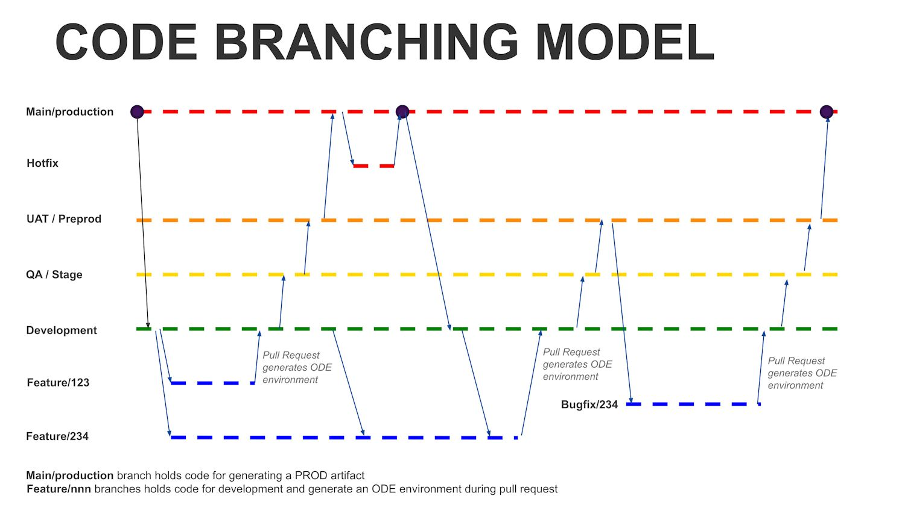

# Acquia Deployments

The project Acquia Cloud subscription contains the following environments: DEV STAGE PROD

Note the ODE (On Demand Environment) and UAT environments are not part of a typical Acquia application and can be ignored.

Looking at the Git workflow below

Developers work on a “local” (Cloud IDE) environment, committing their configuration and code changes to their feature branch.

When it is ready to be merged into the develop branch, they push their branch to Bitbucket and open a Pull Request. Opening, or updating, a Pull Request generates a webhook that triggers a testing build in Acquia Pipelines.

If the testing build succeeds (passes), the Pull Request is reviewed by another developer. If the review is satisfactory, the reviewer will approve the Pull Request and merge the feature branch into the develop branch. That merge will also generate a webhook that triggers a deployment build in Acquia Pipelines that, if successful, is pushed into the Acquia repository for the project subscription.

The DEV environment is configured to track the develop branch. Changes to the develop branch automatically trigger an Acquia Cloud hook in the code repository which applies any Drupal updates to the database, imports the configuration from the develop branch, and clears the Drupal caches.

## STAGE Environment Deployments

The STAGE environment is usually an exact copy of the PROD environment database and files that are often updated via the Acquia Cloud UI before deploying new code to best simulate deploying the code to PROD.

The STAGE environment is associated with the stage branch. To deploy code to STAGE, the develop branch is merged into the master branch. That merge will automatically generate a webhook that triggers a deployment build in Acquia Pipelines that, if successful, is pushed into the Acquia repository for the project subscription. When the build artifact for the stage branch is pushed to Acquia, a tag of the format Q-YYYY-MM-DD-HH-MM-SS is automatically generated and pushed to Acquia right after the artifact. From the Acquia Cloud UI that tag can be selected and will cause the code corresponding to that tag to be deployed to the PROD environment. When that happens it automatically triggers an Acquia Cloud hook in the code repository which which applies any Drupal updates to the database, imports the configuration from the master branch, and clears the Drupal caches.

## PROD Environment Deployments

The PROD environment is associated with the main branch. To deploy code to PROD, the stage branch is merged into the master branch. That merge will automatically generate a webhook that triggers a deployment build in Acquia Pipelines that, if successful, is pushed into the Acquia repository for the project subscription. When the build artifact for the main branch is pushed to Acquia, a tag of the format M-YYYY-MM-DD-HH-MM-SS is automatically generated and pushed to Acquia right after the artifact. From the Acquia Cloud UI that tag can be selected and will cause the code corresponding to that tag to be deployed to the PROD environment. When that happens it automatically triggers an Acquia Cloud hook in the code repository which which applies any Drupal updates to the database, imports the configuration from the master branch, and clears the Drupal caches.

© 2020-2021. This work is licensed under a [Creative Commons Attribution-ShareAlike 4.0 International License](http://creativecommons.org/licenses/by-sa/4.0/).
