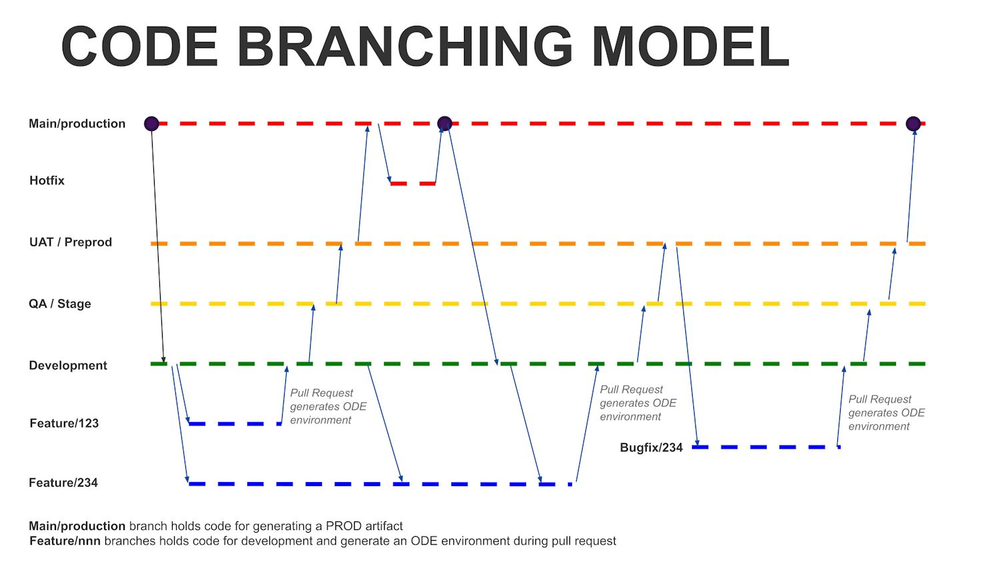
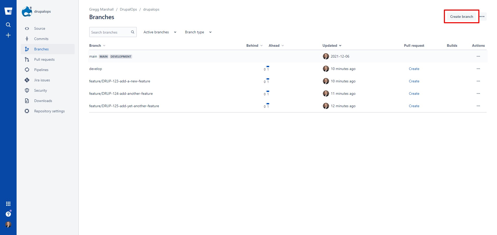
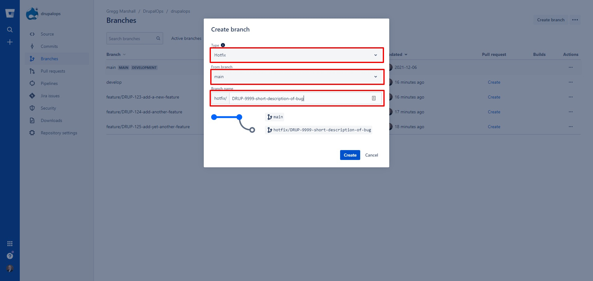
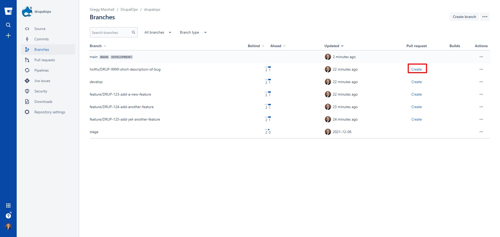
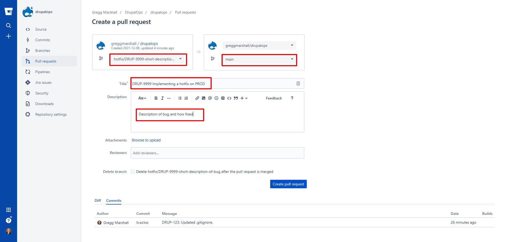
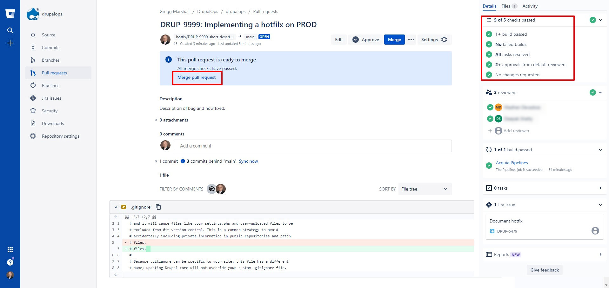
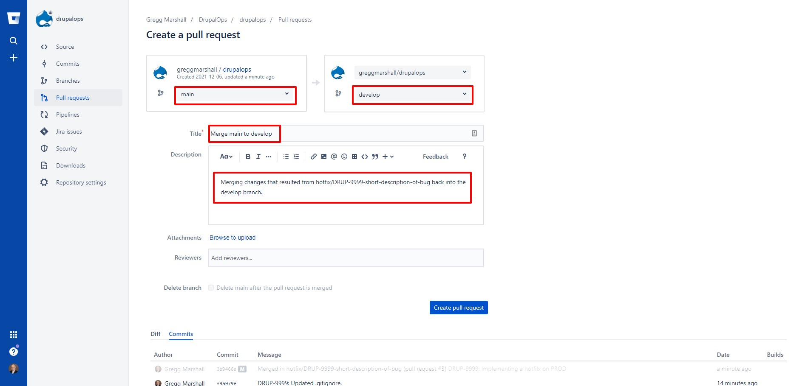

# Creating and Deploying a HOTFIX for Production

Should the production website require a programming fix that needs to be deployed to production outside the standard development process, a HOTFIX process can be used. Instead of starting with the develop branch, the HOTFIX process will start with the main branch which is deployed to production.

 

The process starts with creating a HOTFIX branch from the main branch. This can be accomplished either from the command line or the Bitbucket UI. **If done from the command line, be careful to make sure the branch name starts with “hotfix/”.** This is required to make sure the Acquia Pipelines deploy step deploys the correct branch (qa-stage) when the pull request is merged. This is a side effect of the fact Acquia Pipelines doesn’t expose the target branch in the deploy step so it has to be estimated.

If using the Bitbucket UI (recommended), navigate to the branches page and click on Create Branch

 

Then select main as the source branch and Hotfix as the branch type, edit the balance of the branch name to indicate the issue being worked on. Include the Jira ticket number if possible.

 

The developer assigned with fixing the issue can then checkout the new branch and, using a fresh “blt drupal:sync”, can develop and test the fix, which might include exporting any configuration changes.

    $ git checkout main 
    $ git pull
    $ git checkout hotfix/DRUP-9999-short-description 
    $ blt drupal:sync
    <make change to docroot/README.txt, also possibly changed configuration>
    $ drush config:export 
    $ drush sync:export 
    $ git status
    $ git add docroot/README.txt
    $ git add \<any other changed files shown in git status\> 
    $ git commit -m "DRUP-9999: Edited docroot/README.txt." 
    $ git push

When the fix is complete, the branch is pushed back to Bitbucket and a pull request created:

 

The relevant information is added

 

After review and approval by 2 senior developers, a requirement to merge a branch into the main branch to minimize the risk of the merge, the branch is then merged into the main branch and deployed to production.

 
 
## Merge Main to Develop ASAP

After the hotfix branch is merged into main, a pull request to merge main back into develop (and possibly develop2 if there are parallel development projects) should be opened and merged as soon as possible to avoid the changes made in the hotfix impacting any other development, especially identifying and resolving any possible merge conflicts before the develop or develop2 branch moves through stage and back to main.

 

Finally, after the hotfix is merged to main and develop, the hotfix branch should be deleted from Bitbucket.

© 2020-2021. This work is licensed under a [Creative Commons Attribution-ShareAlike 4.0 International License](http://creativecommons.org/licenses/by-sa/4.0/).
