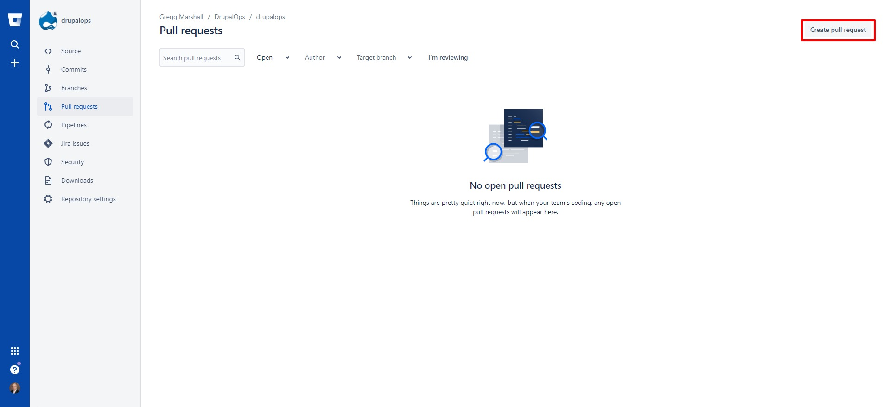

# Deploying code from the DEVELOP branch to the STAGE branch.
 
 

As code is created or modified, developers create feature branches and then open pull requests to have their work merged into the develop branch. This happens relatively frequently, usually several times a day.

That code is automatically built and static tested (and deployed to Acquia) via Acquia Pipelines when a pull request is opened and then deployed via the pipelines-build-develop branch which is built from the develop branch when a pull request is merged. A tag of the form D1-9999-99-99-99- 99-99 is also created using the current pipelines server date and time.

The DEV environment is set to automatically update to the latest commit of that pipelines-build-develop branch, including importing configuration and Site Studio configuration. The INTDEV environment, which is set to allow  do early testing which requires a more stable environment during the tests, is manually set to use the code of a specific tag, which, as time goes on, gets behind the HEAD of the develop branch.

To deploy code to the  environment, the stage branch is used. There are two scenarios for merging the develop branch to stage:

1.  The HEAD of the develop branch is going to be deployed to the stage branch.

2.  A tag, which is behind the HEAD of the develop branch, is going to be deployed to the stage branch. This is illustrated by this diagram:

 

Note that since the tag D1-2021-07-19-19-07-53, there have been 3 commits to the develop branch.

## Deploying code from the HEAD of the DEVELOP branch to the STAGE branch

Deploying code from the HEAD of the develop branch to the stage branch is relatively straightforward. A pull request to merge the develop branch (which implies using its HEAD) to the stage branch.

 

Navigate to the pull requests page of Bitbucket for the repository and click the Create pull request button.

 

The select the develop branch as the source branch, the stage branch as the target branch, add a useful title “Merge develop into stage” and description “Merging develop into stage for release to stage environment” and click the blue Create pull request button.

 

An Acquia Pipelines build, which runs the various static tests, will be triggered. Once completed successfully, a senior developer can review, approve, and merge the request, which will trigger another Acquia Pipelines job to build and deploy the pipelines-build-stage branch and a Q1- 9999-99-99-99-99-99 tag. That tag can be deployed via the Acquia Cloud UI to the stage environment.

## Deploying code from a TAG on the DEVELOP branch to the STAGE branch

Deploying code from a tag on the develop branch to the stage branch is more complex. This process would be required when a tag was deployed to INTDEV and being evaluated by  while development continues on the develop branch. Now, if that same code from INTDEV is intended to be deployed to  for testing and potential release to PROD, then the tag needs to be merged into the stage branch. Bitbucket doesn’t support creating a pull request from a tag. A work around is to create a special branch from the command line and then use Bitbucket’s regular pull request process to merge the branch into the stage branch and trigger the Acquia Pipelines build of stage. Merging the tag directly to stage from the command line and pushing the result to Bitbucket.

 

On the command line execute the following commands:

    $ git checkout develop 
    $ git pull
    $ git checkout -b tag-\<tag name\> \<tag name\>
    $ git push --set-upstream origin tag-\<tag name\> --no-verify

Be careful to ensure the new branch name starts with “tag-”. This is required to make sure the Acquia Pipelines deploy step deploys the correct branch (stage) when the pull request is merged. This is a side effect of the fact Acquia Pipelines doesn’t expose the target branch in the deploy step so it has to be estimated.

Then navigate to the pull requests page of Bitbucket for the repository and click the Create pull request button.

 

The select the tag-\<tag name\>branch as the source branch, the stage branch as the target branch, add a useful title “tag-\<tag name\>into  stage” and description “Merging tag-\<tag name\>into stage for release to  environment” and click the blue Create pull request button.

 

An Acquia Pipelines build, which runs the various static tests, will be triggered. Once completed successfully, a senior developer can review, approve, and merge the request, which will trigger another Acquia Pipelines job to build and deploy the pipelines-build-stage branch and a Q1-9999-99-99-99-99-99 tag. That tag can be deployed via the Acquia Cloud UI to the stage environment.

## Note to Bitbucket users with administrator permissions

You can expedite the pull request process given your permissions. After creating the pull request, navigate to the Acquia Cloud UI for Pipelines and cancel the build job.

 

Then navigate back to Bitbucket and click the Merge button on the pull request. You will be presented with a warning the requirements haven’t been met, go ahead and click Merge

 
 
 **Do not cancel the Acquia Pipelines build triggered by the merge. It generates the pipelines-build-stage branch on Acquia along with a corresponding tag.**

© 2020-2021. This work is licensed under a [Creative Commons Attribution-ShareAlike 4.0 International License](http://creativecommons.org/licenses/by-sa/4.0/).
