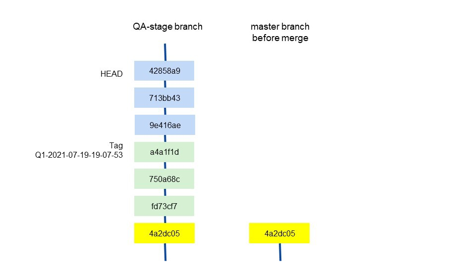
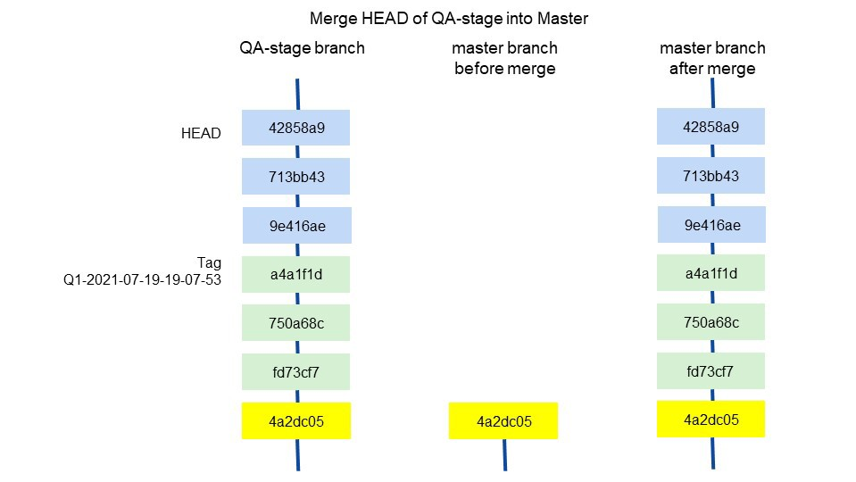
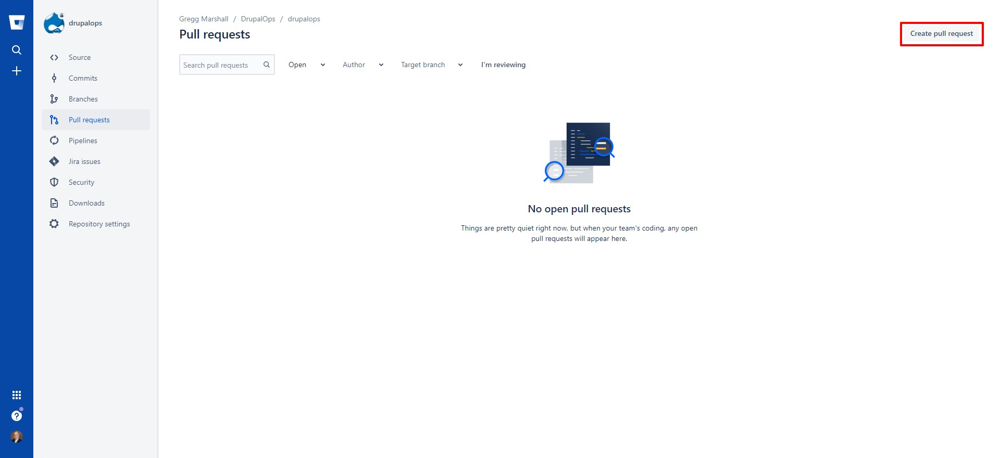
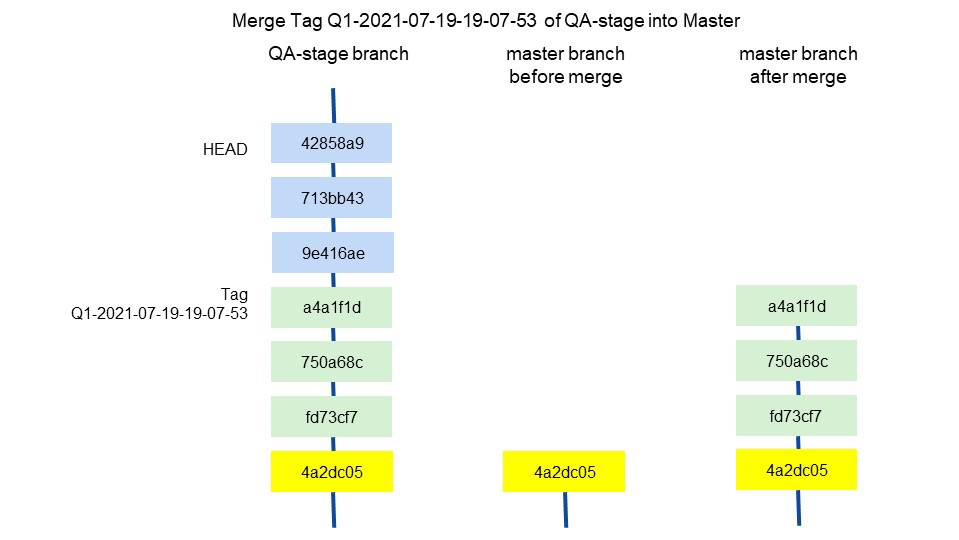
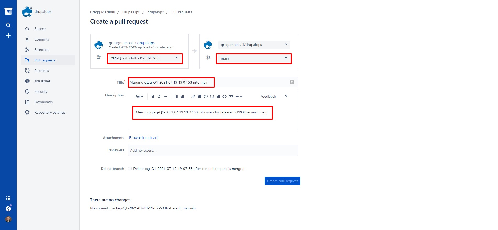
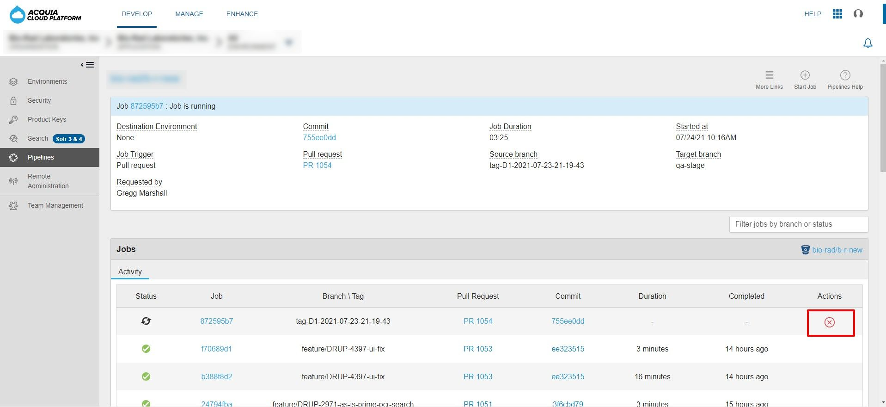
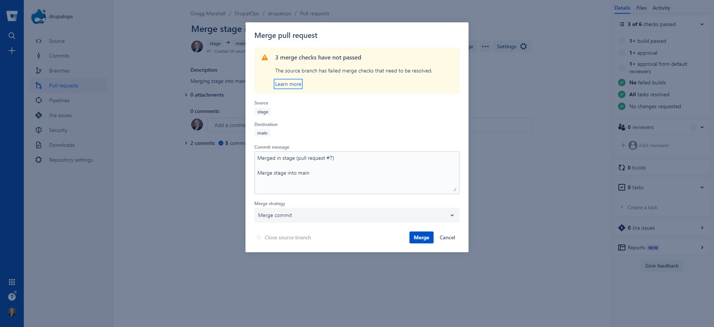

#S Deploying code from the STAGE branch to the MAIN branch.

 

After a release is tested on the  environment, it is time to move that release into the production system. PROD is controlled by the main  branch and its associated tags.

To deploy code to the PROD environment, the main branch is used. There are two scenarios for merging the stage branch into the main branch:

1.  The HEAD of the stage branch is going to be deployed to PROD, the most common scenario.

2.  A tag, which is behind the HEAD of the stage branch, is going to be deployed to PROD, a relatively rare occurrence This is illustrated by this diagram:

 

Note that since the tag Q1-2021-07-19-19-07-53, there have been 3 commits to the stage branch.

## Deploying code from the HEAD of the STAGE branch to the MAIN branch

Deploying code from the HEAD of the stage branch to the main branch is relatively straightforward. A pull request to merge the develop branch (which implies using its HEAD) to the stage branch.

 

Navigate to the pull requests page of Bitbucket for the repository and click the Create pull request button.

 

The select the stage branch as the source branch, the main branch as the target branch, add a useful title “Merging stage into main” and description “Merging stage into main for release to PROD environment” and click the blue Create pull request button.

 

An Acquia Pipelines build, which runs the various static tests, will be triggered. Once completed successfully, a senior developer can review, approve, and merge the request, which will trigger another Acquia Pipelines job to build and deploy the pipelines-build-main branch and a M- 9999-99-99-99-99-99 tag. That tag can be deployed via the Acquia Cloud UI to the PROD environment.

## Deploying code from a TAG on the STAGE branch to the MAIN branch

Deploying code from a tag on the stage branch to the main branch is more complex, **but also relatively rare**. This process would be required when a tag was deployed to  and being evaluated by  while development continues on the develop branch, which gets merged into the stage branch before stage is merged into main. Now, if that same code from  is intended to be deployed to PROD before testing the latest HEAD of the stage branch, then the tag needs to be merged into the stage branch. Bitbucket doesn’t support creating a pull request from a tag. A work around is to create a special branch from the command line and then use Bitbucket’s regular pull request process to merge the branch into the main branch and trigger the Acquia Pipelines build of main. Merging the tag directly to stage from the command line and pushing the result to Bitbucket won’t trigger the required deployment job in Acquia Pipelines.

 

On the command line execute the following commands:

    $ git checkout stage 
    $ git pull
    $ git checkout -b qtag-\<tag name\> \<tag name\>
    $ git push --set-upstream origin qtag-\<tag name\> --no-verify
 
Be careful to ensure the new branch name starts with “qtag-”. This is required to make sure the Acquia Pipelines deploy step deploys the correct branch (main) when the pull request is merged. This is a side effect of the fact Acquia Pipelines doesn’t expose the target branch in the deploy step so it has to be estimated.

Then navigate to the pull requests page of Bitbucket for the repository and click the Create pull request button.

Then select the qtag-\<tag name\>branch as the source branch, the main branch as the target branch, add a useful title “Merging qtag-\<tag name\>into main” and description “Merging qtag-\<tag name\>into main for release to PROD environment” and click the blue Create pull request button.

 

An Acquia Pipelines build, which runs the various static tests, will be triggered. Once completed successfully, two senior developer can review, approve, and merge the request, which will trigger another Acquia Pipelines job to build and deploy the pipelines-build-main branch and a M-9999-99-99-99-99-99 tag. That tag can be deployed via the Acquia Cloud UI to the PROD environment.

# Note to Bitbucket users with administrator permissions

You can expedite the pull request process given your permissions. After creating the pull request, navigate to the Acquia Cloud UI for Pipelines and cancel the build job.

 

Then navigate back to Bitbucket and click the Merge button on the pull request. You will be presented with a warning the requirements haven’t been met, go ahead and click Merge

 
 
 **Do not cancel the Acquia Pipelines build triggered by the merge. It generates the pipelines-build-main branch on Acquia along with a corresponding tag.**

© 2020-2021. This work is licensed under a [Creative Commons Attribution-ShareAlike 4.0 International License](http://creativecommons.org/licenses/by-sa/4.0/).
