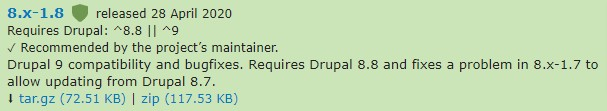
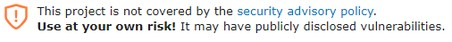
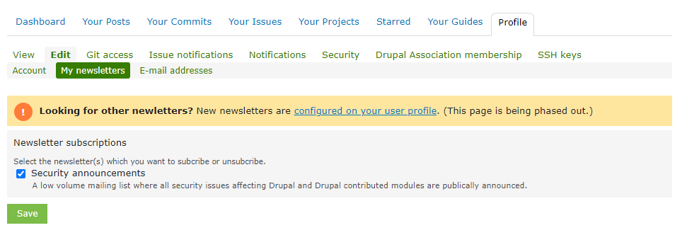

# Drupal Security Core/Module Updates

Drupal has a well established, and active, security team. Composed of a set of respected community volunteers, and one of the first dedicated Security Teams in an open source CMS project, the Drupal Security Team works to resolve reported security issues for code hosted on [drupal.org](http://drupal.org), to review code for vulnerabilities, and to provide security expertise and assistance to contributors. The Drupal community has an excellent track record of finding and fixing vulnerabilities in community-created code.

In an average year, the security team will release approximately 6 notices for Drupal Core and 85 notices for Contributed modules.

Not all modules on [drupal.org](http://drupal.org/) are included in the Drupal Security Team coverage. To be included, a module must have a full release (dev, alpha, beta or rc releases do not qualify) and the module maintainer must opt-in to security team coverage and the module maintainer must go through a review process on a module to ensure they are aware of Drupal best practices. If a module is covered the module’s page on [drupal.org](http://drupal.org/) will show

 

And the releases will show the same shield in the release information.

 

If a module is not covered by the Drupal security advisory policy, the following

 

With a few exceptions, usually core releases resulting from a dependency having an unscheduled security release and preceded by a security team PSA announcement, security releases for contributed modules are scheduled for Wednesdays, usually between between 16:00 UTC and 21:00 UTC. Drupal Core security releases are usually the third Wednesday of the month, again between 16:00 UTC and 21:00 UTC.

## Subscribing to Security Announcements

Any developer or support team member responsible for implementing core and/or module updates should subscribed to the Drupal Security Announcements. There are two ways to do that:

1.  You can subscribe by email by going to your [drupal.org](http://drupal.org/) profile and selecting Edit, My newsletters and checking the box for Security announcements

 

2.  You can subscribe via RSS to the announcements feeds. One way to accomplish that is to use a service like <https://feedrabbit.com/> The free tier is sufficient. There are three RSS feeds to subscribe to:
    
    1.  <https://www.drupal.org/security/rss.xml>
    
    2.  <https://www.drupal.org/security/psa/rss.xml>
    
    3.  <https://www.drupal.org/security/contrib/rss.xml>

## Security Release Timing

Security announcements come with a security risk rating based on the [NIST Common Misuse Scoring System (NISTIR 7864)](http://www.nist.gov/itl/csd/cmss-072512.cfm). The have a score between 0/25 and 25/25 (highest risk). They also are labeled

<table>
<tbody>
<tr>
<td><strong>Score</strong></td>
<td><strong>Severity</strong></td>
</tr>
<tr>
<td>0 to 4</td>
<td>Not Critical</td>
</tr>
<tr>
<td>5 to 9</td>
<td>Less Critical</td>
</tr>
<tr>
<td>10 to 14</td>
<td>Moderately Critical</td>
</tr>
<tr>
<td>15 to 19</td>
<td>Critical</td>
</tr>
<tr>
<td>20 to 25</td>
<td>Highly Critical</td>
</tr>
</tbody>
</table>

 
As a general rule, **any security announcement that is labeled Highly Critical should be immediately deployed to the PROD environment after minimal, if any, testing.** Drupal Core has only had 9 Highly Critical security releases in the past 10 years. But one in 2014 became known as Drupalgeddon, could be exploited by anonymous users, and scripts quickly appeared that crawled the web looking for vulnerable Drupal sites. Most CISO’s mandated that any site not updated within 2-3 hours be fully mitigated, which usually required rebuilding the hosting environment and reinstalling the site from a backup made before the announcement.

Critical and Moderately Critical security announcements should be implemented within a week or two of their release and can be considered an unscheduled core or module update but follow that update release process.

Less Critical and Not Critical security announcements can usually be deferred to the next round of core and module updates, assuming that is not going to be more than a month.

The exception to the above priorities is if, in the description of the possible exploit, as a requirement to take advantage of the exploit, a user is authenticated by Drupal and has certain permissions, given the assumption that the only Drupal authenticated users on the project site (as opposed to being authenticated solely within the browser, e.g. a partially decoupled application) are project employees and contractors, it might be reasonable to delay the deployment of the update for a regular release process, if that same week.

The process for deploying Drupal security updates is the same as for Drupal core and module updates.

## **Highly Critical Drupal Core Security Announcements Since 2010**

<https://www.drupal.org/sa-core-2019-003>

<https://www.drupal.org/sa-core-2018-004> Sometimes called Drupalgeddon 2

<https://www.drupal.org/sa-core-2018-002>

<https://www.drupal.org/forum/newsletters/security-advisories-for-drupal-core/2016-07-18/drupal-core-highly-critical>

<https://www.drupal.org/forum/newsletters/security-advisories-for-drupal-core/2014-10-15/sa-core-2014-005-drupal-core-sql> aka Drupalgeddon

<https://www.drupal.org/forum/newsletters/security-advisories-for-drupal-core/2014-01-15/sa-core-2014-001-drupal-core>

<https://www.drupal.org/forum/newsletters/security-advisories-for-drupal-core/2013-11-20/sa-core-2013-003-drupal-core>

<https://www.drupal.org/forum/newsletters/security-advisories-for-drupal-core/2013-11-20/sa-core-2013-003-drupal-core>

<https://www.drupal.org/forum/newsletters/security-advisories-for-drupal-core/2011-06-30/sa-core-2011-002-drupal-core-access>

© 2020-2021. This work is licensed under a [Creative Commons Attribution-ShareAlike 4.0 International License](http://creativecommons.org/licenses/by-sa/4.0/).
