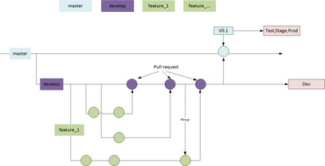
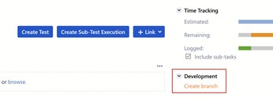

# GIT Process Notes

## Description

**main** will represent current state of production once project is live. While project is under active deployment it will represent a stable-ish build

**develop** will represent branch where all the development work is integrated.

**develop2** will represent branch where a parallel development work is integrated The DEV environment will continuously track the develop branch.

 The DEV2 environment will continuously track the develop2 branch

Tags (D1-…) on the develop branch will control deployment on the INTDEV environment for QA testing

 Tags (D2-…) on the develop2 branch will control deployment on the INTDEV2 environment for QA testing

**qa-stage** will represent the branch being prepared for release to production.

Tags (Q1-…) on the qa-stage branch will control deployment on the QA environment

If not being used for special purposes the STAGE environment will track the qa-stage branch Feature Branches will be used by individual developers for items that they are working on Developers will always submit a pull request to merge their feature branch into develop or develop2 All pull requests need to have a successful Acquia Pipelines build before being reviewed

All pull requests need to be reviewed and approved before merge

We will NOT use release branches for now. This will be revisited closer to go live DEV environment will be built of develop branch

Production and environments will be built on top of **tag** (M-…) taken on main branch We will merge (as opposed to rebase)

> All commit messages will follow the format "DRUP-NNNN: Description, minimum 15 characters." - NNNN represents the task/story number.  Commit messages must end with a period.

<s>Additional branches as needed for CI/CD</s> (not required) Release Branches v/s Scrum closer to go live / after go live TBD parallel releases /environments

## git-br-flow

 
 
 
 **Creating a feature branch**
 
 Create a feature branch in BitBucket. Jira is already integrated with BitBucket hence "create branch" link available in each story/task can be leveraged to create branches as needed
 
 
 
 "create branch" will open BitBucket page with branch name per-populated (using Jira ticket's title). "*feature*" branch should be created from "*devel*" branch barring exceptions.
 
 
 
 Get latest metadata 

    git fetch
 
 First get the latest develop branch git checkout develop
 
     git pull origin develop
 
 TBD add steps on updating the environment with the latest changes
 
 Create a local branch (Assumes the story created the feature branch already in BitBucket.)
 
 To see all available branches either `git branch -a` which will list all remote and local branches or git branch -r which will list all remote branches.
 
     git checkout <feature branch name>
 
 Add and commit files locally 

    git add <file>
 
    git commit -m <BRC-NNNN: 15 character message minimum.>
 
 Push to remote origin
 
    git push origin <feature branch name>
 
 Raise a pull request (once your feature is complete) to merge into develop Delete your local branch
 
     git branch -d <feature branch name>. if you branch has changes and you still want to delete use -D Delete your remote branch
     git push origin --delete <feature branch name>
 
 Checking status
 
     git status
 
 Revert a change
 
 If git add is not yet run
 
     git checkout -- file
     git reset --hard
 
 Note see git stash if you want to save the changes somewhere If git add is run but not git commit
 
     git reset HEAD <file> unstages to current commit
     git reset unstages but retains the file
     git stash save the changes for future
     git reset --hard permanently discard If git commit is run but not pushed to remote
     git revert commitid revert changes from a commit
 
 Merge a branch into yours
 
    git checkout < destination branch to merge into> 
    git merge origin <source branch>

 References

1.  Git Flow - <https://nvie.com/posts/a-successful-git-branching-model/>

2.  GitHub Flow - <https://guides.github.com/introduction/flow/>

3.  Agile and Git Flow - <https://medium.com/ryoshiga/git-flow-for-agile-teams-is-a-no-no-4c202647ac09>

4.  Git Book <https://git-scm.com/book/en/v2>
5.  Atlassian has a useful GIT cheat sheet that can be downloaded from <https://www.atlassian.com/git/tutorials/atlassian-git-cheatsheet>

© 2020-2021. This work is licensed under a [Creative Commons Attribution-ShareAlike 4.0 International License](http://creativecommons.org/licenses/by-sa/4.0/).
