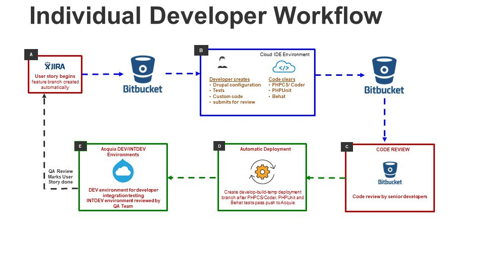
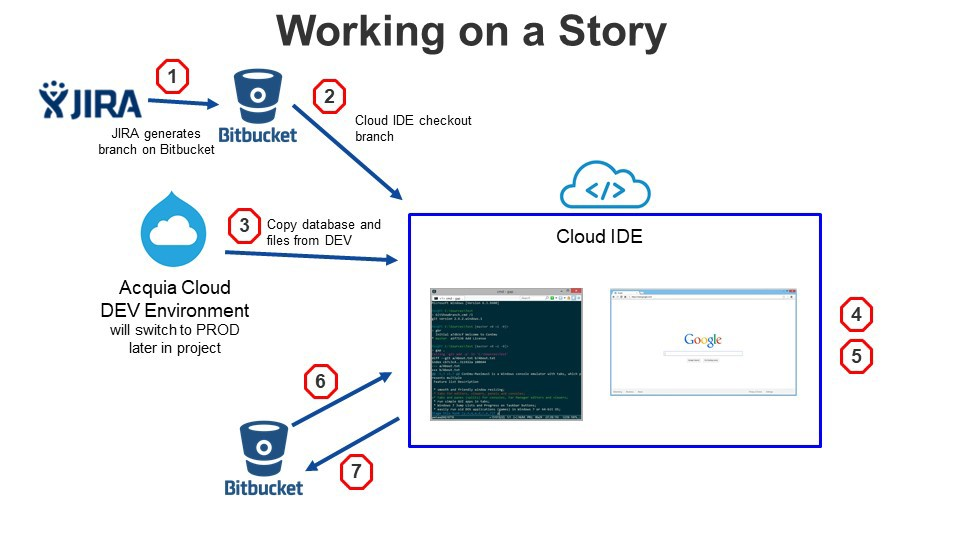
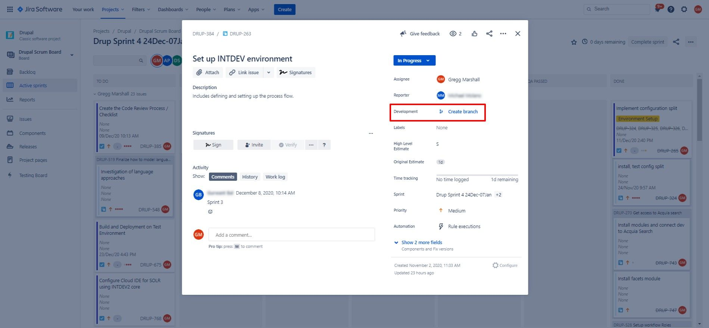
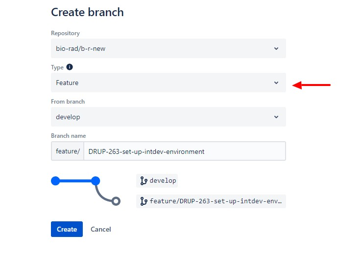
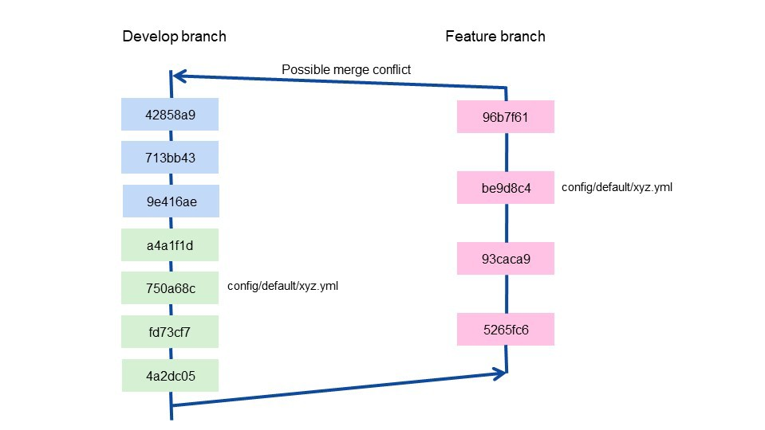
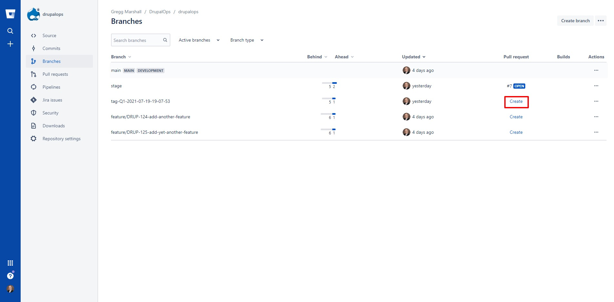
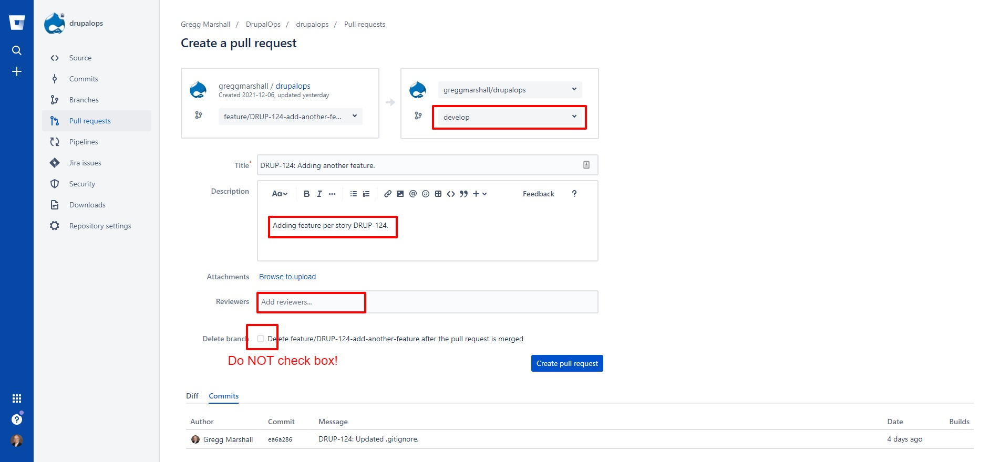
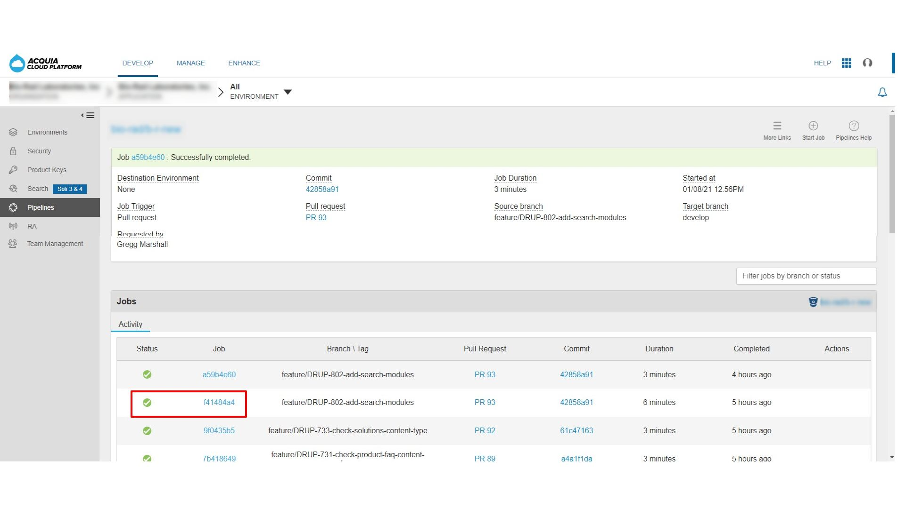

# Individual Development Workflow
 
Note this development workflow is only for traditional Drupal development (configuration and/or custom code). **It is <span class="underline">not</span> for Site Studio development.**

With multiple people are working on a codebase at the same time and a review process for each set of new features, some of which may depend on others to be completed at the same time, it's necessary to create branches for each release so that these can be tested as a group. It follows that you might need to remove a feature from a release if it isn't accepted during testing. This process follows the GitFlow approach, described by Vincent Driessen in 2010: <http://nvie.com/posts/a-successful-git-branching-model/>.

## Development Workflow Overview
 
 

Individual developers work on Jira stories. When starting a story/task/sub-task Jira can automatically generate a feature branch in Bitbucket, naming it with the Jira issue number and the ticket title.

Once the feature branch is generated, the developer will check it out inside a Cloud IDE used for “local” development. Generally the developer will copy the database and files from the production environment using the stage/test environment as the source to reduce loads on the production environment, but during early development the dev environment will be used as the source instead.

The developer will then develop the functionality for that story using Drupal configuration via the Drupal UI as well as possibly creating custom code. After debugging and code validation locally, the developer is ready to generate a Bitbucket pull request. Before doing that, however, the developer should merge the latest version of the develop branch. The merged feature branch is then pushed to Bitbucket and the developer creates a pull request.

Creating or updating a pull request will generate an automated build of the codebase using a newly created Drupal site then runs the automated code validation that checks composer.json validity, YML files validity, whether all custom modules and themes adhere to Drupal coding standards. Additional tests will be added in later sprints. If the build succeeds and all validations pass, the build status is updated in Bitbucket.

With a successful build, that pull request is reviewed by another developer, who is looking for whether the files and changes included in the pull request make sense. Note this code review is **not** QA of the story.

When the pull request is approved, it is merged, triggering an automated build that deploys to the pipelines-build-develop branch on Acquia. The dev environment is configured to automatically track the latest build of the pipelines-build-develop branch.

Developers should work at keeping pull requests small, constrained and frequent.

Individual Story Development Process



## Generate a Feature Branch

From the Jira story, clicking on the “create branch” link will automatically open another tab in Bitbucket creating a branch from the develop branch.

 

The developer does need to switch the branch type from the default Other to Feature to generate the correct branch name. In addition the developer should look at the generated branch name looking the title being trimmed in the middle of a word and should adjust the branch name by deleting the cut off portion of a word.

 

MacOS and Linux enforce case in filenames, Windows does not, therefore branch names should be **<span class="underline">all</span>** lower case, otherwise there is a possibility you might see a branch listed as new in a git pull but in reality the branch is already there. Mixed case can be made to work as long as it is consistent, e.g. in the example above, as long as everyone uses uppercase “DRUP” there shouldn’t be any issues.

## Checkout the Feature Branch in Cloud IDE

Once the branch is created in Bitbucket, the developer needs to check that branch on their Cloud IDE. The commands to do that are:

    $ git fetch --prune

    $ git checkout feature/DRUP-263-set-up-intdev-env

## Copy the Dev Environment Database and Files

 Before running drupal:sync, make sure you have the expected private files directory created within your Cloud IDE:
 
 /home/ide/project/files-private/default

After checking out the feature branch, ideally the developer should copy the latest dev environment database and files. Ultimately the source environment will be the production environment, but during early development we’ll use the dev environment.


    $ blt drupal:sync
    > source:build:composer
    Loading composer repositories with package information Installing dependencies (including require-dev) from lock file Nothing to install or update
    Package container-interop/container-interop is abandoned, you should avoid using it. Use psr/container instead.
    Package doctrine/reflection is abandoned, you should avoid using it. Use roave/better-reflection instead.
    Generating autoload files
    56 packages you are using are looking for funding. Use the `composer fund` command to find out more!
    > [ -d vendor/acquia/coding-standards/src/Standards/AcquiaPHP ] && cp - f blt/acquia-php-ruleset.xml vendor/acquia/coding-standards/src Standards/AcquiaPHP/ruleset.xml
    > drupal:sync:db
    [Acquia\Blt\Robo\Tasks\DrushTask] Running /home/ide/project/vendor/bin/drush cache-clear drush --no-interaction --ansi && /home/ide/project/vendor/bin/drush sql-sync @project.dev @self --target- dump=/tmp/tmp.target.sql.gz --structure-tables-key=lightweight --create- db --no-interaction --ansi && /home/ide/project/vendor/bin/drush cr --no-interaction --ansi in /home/ide/project/docroot
    [success] 'drush' cache was cleared.
    You will destroy data in drupal and replace with data from projectdev. ssh.prod.acquia-sites.com/projectdev.
    [notice] Starting to create database on target.
    [notice] Starting to dump database on source.
    [notice] Copying dump file from source to target.
    Copy new and override existing files at /tmp/tmp.target.sql.gz. The source is project.dev@projectdev.ssh.prod.acquia-sites.com:/tmp/tmp.sql.gz?: yes.
    [notice] Starting to import dump file onto target database.
    [success] Cache rebuild complete.
    [Acquia\Blt\Robo\Tasks\DrushTask] Done in 33.043s
    > drupal:update
    [Acquia\Blt\Robo\Tasks\DrushTask] Running /home/ide/project/vendor/bin/drush @self updb --no-interaction --ansi in /home/ide/project/docroot 
    [success] No pending updates.
    [Acquia\Blt\Robo\Tasks\DrushTask] Done in 2.359s
    > drupal:config:import
    [Acquia\Blt\Robo\Tasks\DrushTask] Running /home/ide/project/vendor/bin/drush @self config:set system.site uuid 9fc2dc41-3dac-4ad7-924c- e0c7dcc31b0b --no-interaction --ansi && /home/ide/project/vendor/bin/drush @self pm-enable config_split --no- interaction --ansi && /home/ide/project/vendor/bin/drush @self config-import sync --no- interaction --ansi && /home/ide/project/vendor/bin/drush @self config-import sync --no- interaction --ansi && /home/ide/project/vendor/bin/drush @self cache-rebuild --no- interaction --ansi in /home/ide/project/docroot
    [notice] Already enabled: config_split
    +------------+---------------------------+-----------+
    | Collection | Config                    | Operation |
    +------------+---------------------------+-----------+
    |            | core.extension            | Update    |
    |            | acquia_connector.settings | Update    |
    |            | shield.settings           | Update    |
    +------------+---------------------------+-----------+
    [notice] Synchronized extensions: uninstall syslog.
    [notice] Synchronized configuration: update acquia_connector.settings. 
    [notice] Synchronized configuration: update shield.settings.
    [notice] Finalizing configuration synchronization.
    [success] The configuration was imported successfully.
    [notice] There are no changes to import.
    [success] Cache rebuild complete.
    [Acquia\Blt\Robo\Tasks\DrushTask] Done in 26.37s
    > drupal:toggle:modules
    > source:build:frontend
    > source:build:frontend-reqs
    > source:build:frontend-assets
    > source:build:frontend
    > source:build:frontend-reqs
    > source:build:frontend-assets
    > drupal:sync:public-files
    [Acquia\Blt\Robo\Tasks\rushTask\] Running /home/ide/project/vendor/bin/drush rsync '@project.dev:%files/' /home/ide/project/docroot/sites/default/files --exclude-paths='styles:css:js' --no-interaction --ansi in /home/ide/project/docroot
    [Acquia\Blt\Robo\Tasks\DrushTask] Done in 3.779s
 
 “blt drupal:sync” does several functions:

1.  `blt source:build:composer`, which is equivalent to composer install.

2.  `blt drupal:sync:db`, which empties your local environment database, then copies the DEV environment database into your local environment database. **NOTE: This step destroys anything you might have in your local database.**

3.  blt drupal:update, which is equivalent to `drush updb`, updating any database schema that might have changed with the updated code.

4.  `blt drupal:config:import`, which is equivalent to `drush config:import`. Note that the blt command actually runs `drush config:import` twice to ensure any changes in the first import that enable additional configuration to be imported function (an example of this is changing the configuration ignored by config_ignore and including the updated configuration, on the first import config_ignore is ignoring the configuration but gets updated, the second import then imports the ignored configuration).

5.  `blt drupal:toggle:modules`, which is not currently being used

6.  `blt source:build:frontend`, which is not currently being used but would normally compile any SASS, JS, etc.

7.  `blt drupal:sync:public-files`, which copies the contents of the /docroot/sites/default/files directory (excluding certain temporary subdirectories which should not be copied), from the DEV environment to your local environment.

8.  `blt drupal:sync:private-files`, which copies the contents of the dev environment private files directory (excluding certain temporary subdirectories which should not be copied), from the DEV environment to your local environment.

9.  `drush sync:import --overwrite-all`, which imports the latest Site Studio package export.

10. `drush cohesion:import`, which imports assets and rebuild element styles (replacement for the CRON).

11. `drush cohesion:rebuild`, which resaves all Site Studio config entities.

One default BLT function, `blt blt:init:settings`, is not included since it has undesirable side effects (like resetting hashes).


## Develop Story Functionality

The developer now actually does the development for the story. That development might involve creating or editing custom code and/or making changes to the Drupal configuration via the Drupal UI.

During development it is possible the developer might add new community modules and/or enable modules using either Drush or the Drupal UI. **These changes should not be included in a pull request.**

Changes to the installed community modules (composer.json) or enabled modules (core.extensions.yml) should be implemented by creating a Jira task or sub-task to add and/or enable modules and assign that task or sub-task to Project Architect.

If the changes you are going to include in your pull request for this story, make sure that task or sub-task is merged before submitting your pull request.

Again, pull requests that include any of the following files will be routinely declined: 


* composer.json
* composer.lock
* default/config/core.extensions.yml

1.  Make changes – either custom code or via configuration changes

2.  Go to the Drupal log page (Reports\>\>Recent log messages, or admin/reports/dblog) and look for errors since you started making changes. Navigate to to or 3 pages and look for recent errors. The goal should be the site doesn’t have any errors being displayed in the logs. Not all errors might be a result of this story, but unrelated errors should be reported via the Microsoft Team chat so they can be addressed sooner, when possible changes that caused them are more easily recognized, than later, when the root cause might be a change made several sprints ago and hard to identify the cause.

3.  Export configuration using drush


    $ drush cex

4.  Validate custom code using blt


    $ blt validate

5.  Add and commit changes – use git status to identify the files to add


    $ git status
    # for each file to be committed
    $ git add path/to/filename1
    $ git add path/to/filename2
    # doublecheck desired files are ready to commit
    $ git commit -m "DRUP-263: Developed functionality for story."

Note the format of the git commit message, which is enforced by a pre-commit git hook. It is the Jira ticket id (DRUP-263), followed by a colon and a single space, followed by a brief description of purpose of the commit at least 15 characters long, ending with a period. You are not limited to a short description for more complex commits. If you use “git commit” alone, git will open an editor that allows you to enter any length commit message you want. Generally you can delete the comments in the file at that point, although if git has prepopulated a list of the files that were changed, I will uncomment them. Line 1 of that commit message must follow the format for the inline commit message above. Generally line 2 is a blank to separate the commit summary from the rest of the commit message. The rest of the commit message can include virtually anything, but commonly it might include the story description and acceptance criteria, any design or development decisions incorporated in the code/configuration being committed. The ultimate goal is to have enough information that some future developer viewing the git log can see what was changed and why. As with all development documentation it is important to assume the person reading it doesn’t have the contextual information you have as the developer.

## Do <span class="underline">not</span> use “git add .”, “git add \*”, or “git add -A” or “git add --all”\!

If your commit includes exported configuration, review the files that are created or changed. It is common to have configuration exported that is not relevant to, or necessary to be included with, the configuration changes that were made as part of the story. You might have changed configuration to help in debugging or to make testing easier. Even if that configuration is changed back, it is possible it might generate a configuration export file.

Best practice is to add each file one at a time. If using partial wildcards, be careful to make sure the pattern doesn’t accidentally add unintended configuration files.

## Rebasing before a merge request

Note this use of rebase is different from the use of rebase as a merge strategy. Mixing a rebase merge strategy with a traditional merge strategy can cause issues. But using rebase on a single feature branch to rewrite the commit history is a way to clean up extraneous commits.

Also note that once you merge the develop branch back into your feature branch, or push your feature branch to Bitbucket, git will generally prohibit rewriting your commit history.

The “git rebase -i” is to remove any extraneous commits before the latest development branch is merged in. Most developers commit changes frequently to save intermediate results, often ending up with a lot of commits that ultimately are redundant, such as “adding debugging code” followed by “removing debugging code”. Before using “git rebase -I”, make sure you have your editor configured correctly. When you type that command, your editor will open and you will see something that looks like:


```
# pick f7f3f6d adding debugging code 
# pick 310154e removing debugging code
# pick a5f4a0d updated README formatting and added cat-file
# Rebase 710f0f8..a5f4a0d onto 710f0f8
#
# Commands:
# p, pick \<commit\> = use commit
# r, reword \<commit\> = use commit, but edit the commit message
# e, edit \<commit\> = use commit, but stop for amending
# s, squash \<commit\> = use commit, but meld into previous commit
# f, fixup \<commit\> = like "squash", but discard this commit's log message
# x, exec \<command\> = run command (the rest of the line) using shell
# b, break = stop here (continue rebase later with 'git rebase -- continue')
# d, drop \<commit\> = remove commit
# l, label \<label\> = label current HEAD with a name
# t, reset \<label\> = reset HEAD to a label
# m, merge \[-C \<commit\> | -c \<commit\>\] \<label\> \[\# \<oneline\>\]
# . create a merge commit using the original merge commit's
# . message (or the oneline, if no original merge commit was
# . specified). Use -c \<commit\> to reword the commit message.
#
# These lines can be re-ordered; they are executed from top to bottom.
#
# If you remove a line here THAT COMMIT WILL BE LOST.
#
# However, if you remove everything, the rebase will be aborted.
#
# Note that empty commits are commented out
```

Since the two commits we want to eliminate are in front of the one we want to keep, move the one to keep to be first. Use the fixup option instead of the squash option to ignore the commit messages. And use fixup instead of drop in case there are changes in the commit(s) that aren’t just adding or removing debugging code.


```
fixup f7f3f6d adding debugging code 
fixup 310154e removing debugging code
pick a5f4a0d updated README formatting and added cat-file
# Rebase 710f0f8..a5f4a0d onto 710f0f8
#
# Commands:
# p, pick \<commit\> = use commit
# r, reword \<commit\> = use commit, but edit the commit message
# e, edit \<commit\> = use commit, but stop for amending
# s, squash \<commit\> = use commit, but meld into previous commit
# f, fixup \<commit\> = like "squash", but discard this commit's log message
# x, exec \<command\> = run command (the rest of the line) using shell
# b, break = stop here (continue rebase later with 'git rebase -- continue')
# d, drop \<commit\> = remove commit
# l, label \<label\> = label current HEAD with a name
# t, reset \<label\> = reset HEAD to a label
# m, merge \[-C \<commit\> | -c \<commit\>\] \<label\> \[\# \<oneline\>\]
# . create a merge commit using the original merge commit's
# . message (or the oneline, if no original merge commit was
# . specified). Use -c \<commit\> to reword the commit message.
#
# These lines can be re-ordered; they are executed from top to bottom.
#
# If you remove a line here THAT COMMIT WILL BE LOST.
#
# However, if you remove everything, the rebase will be aborted.
#
# Note that empty commits are commented out
```


After updating the picks to fixup or whatever, save the result and close the tab in your editor. Git will wait until the editor window is closed before continuing execution. If nothing appears to be happening, check for an open editor window with something from git it in.

## Merge Develop Branch Before Pull Request

As you are working on your feature branch, other developers are also working. It is very likely that in the amount of time the average story takes to complete and be ready for submitting a pull request several other feature branches have been approved and merge. So while at the start of the feature branch, it and the develop branch are the same, both have changed in the elapsed time. If the other features merged into develop and your feature branch don’t have any overlapping files, merging back into the develop branch is not an issue. Even if one or more files is is modified by both your feature branch and some other merged branch, git is very good about sorting out what changed and merging the different changes.

 

If git can’t resolve how to merge changes from both branches, the merge request will be halted and the conflicting changes will be flagged in a uniform way in the file(s) having conflicts. This is known as a merge conflict.

 **The developer doing a code review and merge is <span class="underline">not</span> responsible for resolving a merge conflict.** To minimize the chance of that happening, or to allow resolving any merge conflicts <span class="underline">before</span> the pull request is created, best practice is to merge the latest version of the develop branch into your feature branch immediately before pushing the branch to Bitbucket and opening the pull request. To accomplish that


    $ git status
    # There should be no modified or deleted files. Untracked files are usually not an issue.
    # If there are modified/deleted files, use git stash to save them for later or
    # git reset --hard to eliminate them.
    $ git checkout develop
    $ git pull
    $ git checkout feature/DRUP-263-set-up-intdev-env
    $ git merge develop

If the merge results in a merge conflict, the files that need to have resolution are listed. Opening them in the Cloud IDE will use a feature in Theia that allows you to select incoming change (develop branch) or select current change (feature branch). The developer needs to evaluate which is more likely to be correct. Experience indicates that the feature branch often is correct since it represents changes that would be applied if the branch were created after the other branches were merged into develop. This is not a hard and fast rule and the developer needs to evaluate them one by one. After all the conflicts have been resolved (make sure to check for more than one conflict per file), the files with conflicts need to be added and committed


    $ git status
    # files that required resolution will be listed as needing to be added
    $ git add file1
    $ git add file2
    $ git merge -m "DRUP-263: Merged develop branch before pull request."

## Push Branch and Create Pull Request

The feature branch is now ready to be pushed to Bitbucket and a pull request created

    $ git push

 Once the pre-push checks are complete and the branch is pushed to Bitbucket, switch to the Bitbucket UI and create a pull request (**do <span class="underline">not</span> select the close branch after merge option**)
 
 
 
 

#### Again, do <span class="underline">not</span> select the close branch after merge option

Wait a few minutes (approximately 6 to 7) and check the status of your Acquia Pipelines build that is started when you create the pull request

 

If successful, the pull request is ready for another developer to review, approve, and ultimately merge.

If the build fails, click on the Job ID to display the logs and check the last section before the Finalized section. It will open to the end of the log for that section, which usually shows the error that halted the build. You might need to go back 100 lines or more to see all the steps leading up to the error.

## After Merge Delete Your Feature Branch

 Keep your feature branch until the code review is completed and your pull request is approved and merged into develop. **Then wait at least an hour after the merge request before deleting your feature branch.**

When it is ok to delete your feature branch you need to delete it in 3 locations:

1.  On Bitbucket, go to the branch listing page and select delete from the … actions column.

2.  In your local development environment using


    $ git branch -d feature/DRUP-263-set-up-intdev-env

Note you might get an error that the branch isn’t fully merged, you can use “git branch -D” to ignore that.

3.  In your local development remote-tracking references (otherwise a “git branch -a” will show the branch but trying to check it out will fail)


    $ git fetch --prune

© 2020-2021. This work is licensed under a [Creative Commons Attribution-ShareAlike 4.0 International License](http://creativecommons.org/licenses/by-sa/4.0/).
