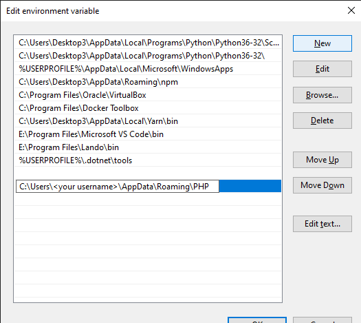

# Installing Acquia CLI on Windows 10

### Prerequisites

**Windows 10**

PHP 7.3 or later with the [PHP-JSON](https://www.php.net/manual/en/book.json.php) and [PHP-PHAR](https://www.php.net/manual/en/book.phar.php) extensions enabled. To check if you have PHP installed (correctly), in a CMD or Powershell terminal type `php -v` to check if PHP is installed and what version it is.

### Installing PHP on Windows

1.  Go to <https://windows.php.net/download/> and download the 64 bit non-thread safe version of PHP

2.  Unpack the content of the zip archive into a directory of your choice, C:\\Users\\\<your username\>\\AppData\\Roaming\\PHP is recommended.

3.  In the Windows search box type “edit environment variable” to open the System Properties dialog, the click the Environment Variables button near the bottom of the dialog, select the Path from the User Variables list (top dialog), click Edit, then click New and add `C:\Users\<your username>\AppData\Roaming\PHP`, click OK to save you environment variable. Note after changing the environment variables you need to close and re-open your terminal window.

Use `php -i` to determine where your PHP executable is located, which is usually also the same location of the php.ini file you might need to edit:

    $ php -i phpinfo()
    PHP Version =\> 7.4.12
    System =\> Windows NT DESKTOP-DQ0T6S1 10.0 build 18363 (Windows 10) AMD64 Build Date =\> Oct 27 2020 17:12:23
    Compiler =\> Visual C++ 2017 Architecture =\> x64
    Configure Command =\> cscript /nologo /e:jscript configure.js "--enable- snapshot-build" "--enable-debug-pack" "--with-pdo-oci=c:\\php-snap- build\\deps\_aux\\oracle\\x64\\instantclient\_12\_1\\sdk,shared" "--with-oci8- 12c=c:\\php-snap-build\\deps\_aux\\oracle\\x64\\instantclient\_12\_1\\sdk, shared" "--enable-object-out-dir=../obj/" "--enable-com-dotnet=shared"
    "--without-analyzer" "--with-pgo" Server API =\> Command Line Interface Virtual Directory Support =\> enabled Configuration File (php.ini) Path =\>
    Loaded Configuration File =\> C:\\Users\\\<your username\>\\AppData\\Roaming\\PHP\\php.ini
    Scan this dir for additional .ini files =\> (none) Additional .ini files parsed =\> (none)
    PHP API =\> 20190902
    PHP Extension =\> 20190902 Zend Extension =\> 320190902
    Zend Extension Build =\> API320190902,TS,VC15 PHP Extension Build =\> API20190902,TS,VC15 Debug Build =\> no

### Install ACLI

1.  Download ‘[**acli.phar**](https://github.com/acquia/cli/releases/download/1.1.1/acli.phar)’ from [https://github.com/acquia/cli/releases](https://github.com/acquia/cli/releases) and copy to a workspace folder, the same folder as your php.exe is stored in (`C:\Users\<your username\>\ppData\\Roaming\PHP` if installed as above) is highly recommended since it is already in your path.

2.  In the `C:\Users\<your username\>\AppData\Roaming\PHP` directory, create a file acli.bat that contains:

    @ECHO OFF
    php "%\~dp0acli.phar" %\*

3.  Add the folder to your path environment variable if not already in the path

© 2020-2021. This work is licensed under a [Creative Commons Attribution-ShareAlike 4.0 International License](http://creativecommons.org/licenses/by-sa/4.0/).
