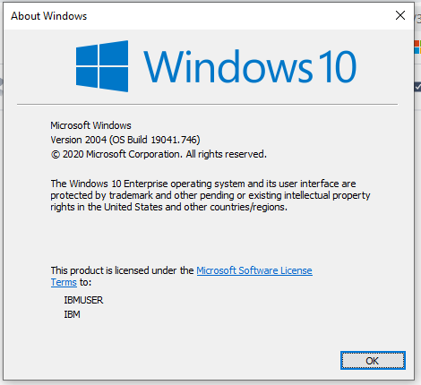
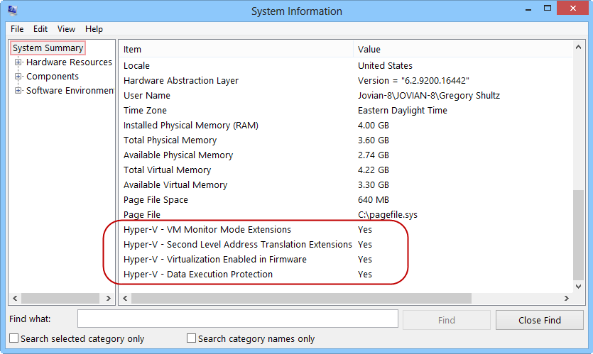
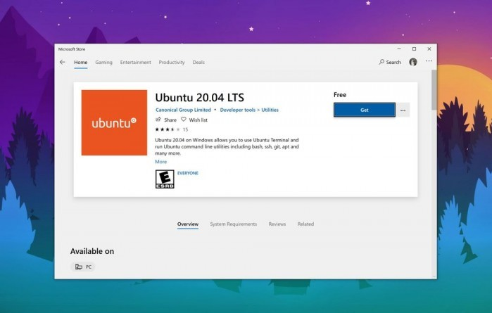
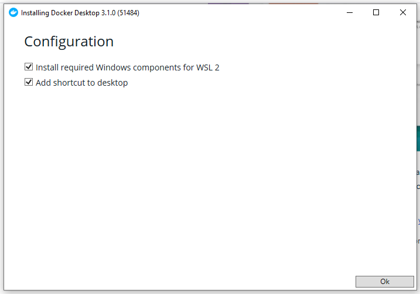
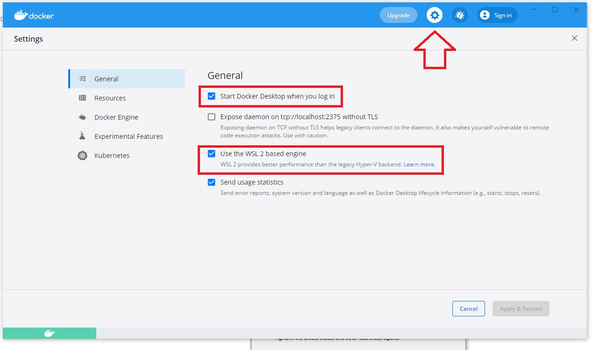
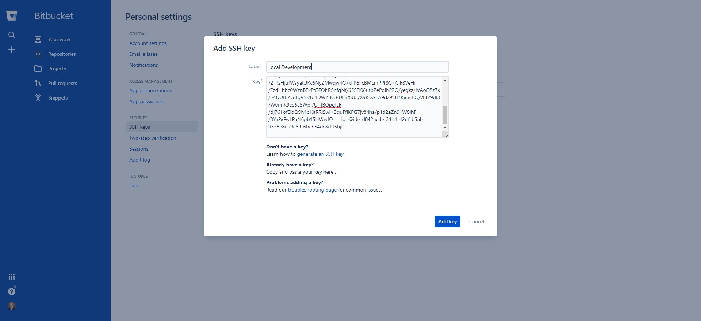

# Local Development Environment Setup using DDEV
 
 There are a number of important information panels at the end of this page, please make sure to review them.
 
 While the plan is to use Acquia Cloud IDEs for project development, it will be useful to also have the option to have a local development environment running on an individual developer’s laptop. Based on the current development team, the assumption is developers are running reasonably powered Windows 10 computers.

### Local Development System Requirements

 Windows 10 version 2004 or later
 
 Hyper-V Virtualization capable, thus WSL2 compatible User account has administrative access
 
 At least 8 GB RAM, 16 GB preferred.
 
To check the windows version hold the Windows key and type R, then enter “winver” in the run dialog to display the current windows version:
 
 
 
 To check if your system supports Hyper-V hold the Windows key and type R, then enter “msinfo32 ” in the run dialog to run System Information. That opens the app shown here, with the System Summary page visible. Scroll to the very end and look for the four items that begin with Hyper-

5.  If you see a Yes next to each one, you're ready to enable Hyper-V.

 
 

 If Hyper-V is already enabled, you may see the message “A hypervisor has been detected. Features required for Hyper-V will not be displayed.” at the bottom of the summary instead of the 4 Hyper-V items.

 Do not attempt to do the installation while connected to the project VPN. The reduction in performance using the VPN, and other possible issues, make successfully installing the DDEV local environment much harder. **Proceed while connected to the VPN at your own risk.**
 
### Enable WSL2
 
 WSL 2 is a new architecture that completely changes how Linux distributions interact with Windows. It's basically a native Linux kernel in Windows 10. The goal is to increase the file system performance and adding full system call compatibility. WSL 2 is the new de facto-standard backend for Docker Desktop on Windows. Docker Desktop uses the dynamic memory allocation feature in WSL 2 to greatly improve the resource consumption. This means, Docker Desktop only uses the required amount of CPU and memory resources it needs, while enabling CPU and memory-intensive tasks such as building a container to run way faster. Additionally, with WSL 2, the time required to start a Docker daemon after a cold start is significantly faster.
 
 These instructions follow the manual installation steps from the Microsoft documentation at [https://docs.microsoft.com/en-us/windows/wsl/install-](https://docs.microsoft.com/en-us/windows/wsl/install-win10) [win10](https://docs.microsoft.com/en-us/windows/wsl/install-win10) because it assume the necessary preview release is not being used.
 
 Step 1 - Enable the Windows Subsystem for Linux. Open PowerShell as Administrator and run:
 
    dism.exe /online /enable-feature /featurename:Microsoft-Windows- Subsystem-Linux /all /norestart
 
 Step 2 - Enable Virtual Machine feature. Open PowerShell as Administrator and run:
 
    dism.exe /online /enable-feature /featurename:VirtualMachinePlatform /all /norestart
 
 Step 3 - Reboot your Computer. Restart your machine to complete the WSL install and update to WSL 2. 

Step 4 - Download the Linux kernel update package. Download the latest package:
 
 [WSL2 Linux kernel update package for x64 machines](https://wslstorestorage.blob.core.windows.net/wslblob/wsl_update_x64.msi)
 
 Step 5 - Set WSL 2 as your default version. Open PowerShell as Administrator and run:
 
    wsl --set-default-version 2
 
 Install a Linux Distro
 
 Open the [Microsoft Store](https://aka.ms/wslstore) and select your favorite Linux distribution. Assuming the latest LTS version of Ubuntu (20.04)[U, buntu 20.04 LTS](https://www.microsoft.com/store/apps/9n6svws3rx71)
 
 From the distribution's page, select "Get".
 
 
 
 The first time you launch a newly installed Linux distribution, a console window will open and you'll be asked to wait for a minute or two for files to de-compress and be stored on your PC. All future launches should take less than a second.
 
 You will then need to [create a user account and password for your new Linux distribution](https://docs.microsoft.com/en-us/windows/wsl/user-support). Note that this username and password do not need to be the same as your Windows machine. The username will determine your home directory name (e.g. /home/username) and the password will be used frequently if you use sudo (which you will).
 
 While you have the Ubuntu terminal window open, take a moment to pin it to the taskbar by right clicking the Ubuntu icon in the taskbar and selecting pin to taskbar.
 
 ### Install Docker Desktop CE
 
 Download the latest version of Docker Desktop Community Edition from <https://hub.docker.com/editions/community/docker-ce-desktop-windows/>. After it downloads (approximately 500MB), double click on the “Docker Desktop Installer.exe” file to start the installation process. Keep both selected options:
 
 
 
 Note you are installing Docker Desktop for Windows in Windows. There are alternative instructions (including from Lando) to install docker inside the Linux distribution. They appear to be oriented to the older WSL 1 version and claim better performance although the officially supported installation for WSL 2 is as indicated above. It takes awhile to download the rest of the Docker package and install it. After installation you need to close the installer and logout, I recommend just rebooting your computer to make sure everything is completely installed.
 
 After rebooting Docker Desktop will automatically load. As you go through setup, you’ll be asked to run a test, which you should do from your Ubuntu terminal. You can copy from Windows and paste into the Ubuntu terminal window
 
    docker run -d -p 80:80 docker/getting-started
 
 Nothing appears to happen but if you look you will see a running container
 
    docker container ls
 
 You might want to kill the container to free up its resources
 
    docker container kill a1f916c88629
 
 The last series of digits are displayed in the docker container ls command output. Finally make sure that Docker is configured correctly. In your toolbar (lowest right corner), select the Docker whale and click the gear icon at the top of its window. Make sure Docker is step to automatically start when you log into Windows and, most importantly, it is **set to use the WSL 2 based engine,** although the test above likely wouldn’t have worked if it weren’t.
 
 
 
 ### Install Homebrew for Linux
 
 DDEV is installed on Mac and Linux using Homebrew. Homebrew for Linux is installed using the Homebrew for Linux documentation at [https://doc](https://docs.brew.sh/Homebrew-on-Linux) [s.brew.sh/Homebrew-on-Linux](https://docs.brew.sh/Homebrew-on-Linux).
 
     $ /bin/bash -c "$(curl -fsSL https://raw.githubusercontent.com/Homebrew/install/HEAD/install.sh)"
 
 You can test the installation using Hello
 
     $ brew install hello
     $ hello Hello, World\!
     $ brew uninstall hello
 
### Install DDEV
 
 With Homebrew for Linux installed, insmkcert -installalling ddev is as simple as:
 
     $ brew tap drud/ddev && brew install ddev
 
 DDEV recommends creating certificates
 
 The `mkcert -install` step on Linux may provide you with additional instructions.
 
 On variants of Linux you may be prompted for additional package installation to get certutil installed, but you can follow the instructions given by mkcert:
 
     $ mkcert -install
     Created a new local CA at "/home/username/.local/share/mkcert"
     Installing to the system store is not yet supported on this Linux but Firefox and/or Chrome/Chromium will still work. You can also manually install the root certificate at "/home/username/.local/share/mkcert/rootCA.pem". Warning: "certutil" is not available, so the CA can't be automatically installed in Firefox and/or Chrome/Chromium\! Install "certutil" with "apt install libnss3-tools" or "yum install nss-tools" and re-run "mkcert -install"
 
 (Note the prompt Installing to the system store is not yet supported on this Linux, which can be a simple result of not having /usr/sbin in the path so that /usr/sbin/update-ca-certificates can be found.)
 
The DDEV documentation is at <https://ddev.readthedocs.io/en/stable/>
 
 If, at any time, Bitbucket or Acquia complains about invalid keys while using DDEV as a command prefix (e.g. ddev blt drupal: sync), you may have restarted the containers and the command to use your Linux SSH keys may have been forgotten. Just use `ddev auth ssh`
 
### Install Additional Tools on Ubuntu
 
 While DDEV typically installs all the tools you need inside the Docker containers, there are some tools that are handy to have outside DDEV: PHP 7.4
 
* Composer 2 

* NodeJS 

* YARN
 
* Zip and Unzip
 
* ACLI (Acquia’s Command Line Interface)
 
* **PHP 7.4**
 
     $ sudo apt-get update
     $ sudo apt install php7.4-cli
     $ sudo apt-get install php7.4-curl sudo apt-get install php7.4-mbstring sudo apt-get install php7.4-dom
     $ sudo apt-get install php7.4-xmlwriter sudo apt-get install php7.4-zip
     $ sudo apt-get install php7.4-simplexml sudo apt-get install php7.4-gd
     $ php --version
 
 * **Composer 2**
 
 Installed with PHP 7.4(?). Verify that with the command `composer --version
 `
 If the version starts with 1.x.x then update to Composer 2 using composer update, if composer isn’t found see [http://getcomposer.org](http://getcomposer.org/) for installation instructions on Ubuntu.
 
* **NodeJS**
 
    $ sudo apt install nodejs sudo apt install npm node -v
    $ npm -v
 
* **YARN**
 
    $ sudo apt install cmdtest
 
* **Zip and Unzip**
 
    $ sudo apt install zip unzip php-zip
 
* **ACLI (Acquia Command Line Interface)**
 
    $ curl -OL https://github.com/acquia/cli/releases/latest/download/acli. phar
    $ chmod +x acli.phar
    $ sudo mv acli.phar /usr/local/bin/acli acli --version
 
 To begin using [Acquia CLI](https://github.com/acquia/cli), authenticate against your Cloud Platform account by using acli auth:login. This command prompts you to open the page from which to create a [Cloud Platform API token](https://docs.acquia.com/cloud-platform/develop/api/auth/#cloud-generate-api-token)  at [https://cloud.acquia.com/a/profile/tokens](https://cloud.acquia.com/a/profile/tokens) for convenience.
 
 **Copy and save the API key & API secret in notepad and save the file where you can reference it.**
 
 Here’s an example output:

    $ acli auth:login
    You will need a Cloud Platform API token from https://cloud.acquia.com/a/profile/tokens
    Do you want to open this page to generate a token now? y 
    Please enter your API Key: <ENTER API KEY HERE>
    Please enter your API Secret: <ENTER API SECRET HERE> 
    Saved credentials to /home/<user>/.acquia/cloud_api.conf
 

Note you can use the same API Key and Secret as your did for your Cloud IDE if you saved them.

 
 It appears there may be an issue using ACLI from inside Ubuntu. Despite successfully logging in with the “acli auth:login” command above, trying to use any ACLI command that accesses Acquia gives a “Your Cloud Platform API credentials are invalid. Run acli auth: login to reset them.” error. There are work arounds for most of the issues.
 
### Install VS-Code on Windows
 
 While you can use any IDE or editor you want, be aware that there is no GUI in the Ubuntu distro installed with WSL2. For screen editors like VIM or EMACS, you can go ahead and install them inside Ubuntu. If you want to use a GUI IDE, VS-Code is free and Microsoft has built in support for integrating it from the Ubuntu terminal. If you are inside Ubuntu, **and you have VS-Code installed on Windows**, and type `code <filename>` or `code .` you will see
 
     Installing VS Code Server for x64 (ea3859d4ba2f3e577a159bc91e3074c5d85c0523) Downloading: 100%
     Unpacking: 100%
     Unpacked 1722 files and folders to /home/yourusername/.vscode-server/bin/ea3859d4ba2f3e577a159bc91e3074c5d85c0523.
 
 And a few seconds the file or project will be opened in a copy of VS-Code on the Windows side. To install VS-Code on Windows, navigate to [https://code.visualstudio.com/download](https://code.visualstudio.com/download) and download the Windows 64 bit installer. Execute that installer and follow the directions.
 
 There are a number of useful VS-Code extensions to consider installing.
 
### Setup Local Environment
 
#### Configure your SSH Keys and Upload to Acquia
 
 Acquia’s ACLI will automatically take care of creating your SSH keys inside Ubuntu and uploading them to Acquia. It is the different process than in the Cloud IDE setup.

#### Option 1, copy your Windows SSH Keys to Ubuntu

 If you already have SSH keys in Windows that have been uploaded to Acquia (and possibly Bitbucket), an easy way to have SSH keys in Ubuntu is to copy the Windows files to the appropriate location in Ubuntu. You can do this entirely using Windows File Explorer by navigating to your user home directory C:\\Users\\windowsusername\\.ssh, select all the files and type control-C or right click and select copy.
 
 Then navigate to your user home directory in Ubuntu using the \\\\wsl$ file system server mount such as \\\\wsl$\\Ubuntu-20.04\\home\\ubuntuusername\\.ssh and paste the files copied from your Windows .ssh directory.

#### Option 2, generate new SSH Keys in Ubuntu

 You can generate new SSH Keys in Ubuntu using the ssh-keygen command from inside Ubuntu. Before generating new SSH keys you might want to double check that you don’t already have SSH keys that you might overwrite:
 
    $ cd \~/.ssh
    $ ls -la
 
 If the directory doesn’t exist in line 1, skip line 2 and it is safe to create new SSH keys. If the output from line 2 includes the files id\_rsa and id\_rsa. pub, you already have SSH keys generated. It might be best to keep them and use them (although it is possible they aren’t long enough for Acquia, which means you’ll need to regenerate them).
 
 Then generate the SSH keys using the command
 
    $ ssh-keygen -b 4096
    Generating public/private rsa key pair. 
    Enter file in which to save the key (/home/ubuntuusername/.ssh/id_rsa):
    Enter passphrase (empty for no passphrase): [passphrase] 
    Enter same passphrase again: [passphrase]
 
 Alternatively you can use the ACLI command `acli ssh-key:create`.

#### Upload SSH Keys to Acquia

 Acquia’s ACLI has a command acli ssh-key:upload that can be used to automatically upload your SSH keys to Acquia, but the current issue with authentication from inside Ubuntu will generate a Your Cloud Platform API credentials are invalid. Run acli auth: login to reset them.error at this time.
 
 Instead, use the Acquia Cloud UI to upload your SSH keys manually. See <https://docs.acquia.com/cloud-platform/manage/ssh/enable/add-key/> for detailed instructions how to upload your SSH public key to your Acquia Cloud account. To verify you have access, try the SSH command from the Ubuntu command line:
 
     $ ssh project.dev@projectdev.ssh.prod.acquia-sites.com
     The authenticity of host 'projectdev.ssh.prod.acquia-sites.com (54.188.28.88)' can't be established.
     RSA key fingerprint is SHA256: htZXJDCRcqD+7VAF3j9fH95yaNrPmq4Oip+ZTv9zTL4.
     Are you sure you want to continue connecting (yes/no/[fingerprint])? yes 
     Warning: Permanently added 'projectdev.ssh.prod.acquia-sites.com, 54.188.28.88' (RSA) to the list of known hosts.
     Welcome to Acquia Cloud. For information about shell access on this server, please see: https://docs.acquia.com/acquia-cloud/ssh
     Usage may be monitored and audited. 
     project@staging-39761:\~$ ls -la
 
 #### Configure Bash Prompt (optional)
 
 The default bash prompt shows the host computer username and computer ID followed by the current path. If you’d rather have the path and the current branch if inside a git repository, you can make the following changes:
 
 Assuming VS-Code, edit the \~/.bashrc file using
 
     $ code ~/.bashrc
 
 Once the file loads, around line 60 change the line that reads
 
    PS1='${debian_chroot:+($debian_chroot)}[\033[01;32m\]\u@\h\[\033\[00m\]:\[\033\[01;34m\]\w\[\033\[00m\]\$ '
 
 With the line
 
    PS1="\[\e[32m\]\w \[\e[91m\]\$(parse_git_branch)\[\e[00m\]$ "
 
 Then about line 4 insert the following
 
    parse_git_branch() {
        git branch 2> /dev/null | sed -e '/^[^*]/d' -e 's/* \(.*\)/(\1)/'
    }

 
 After saving the file, you can load the results using
 
     $ source ~/.bashrc
 
#### Configure GIT
 
 Set up Git on your IDE with three configuration items:
 
     $ git config --global user.email "your project email address"
     $ git config --global user.name "your full name"
     $ git config --global pull.rebase false
 
 Assuming you have also installed VS-Code in Windows you can use it as the git editor by the command
 
     $ git config --global core.editor "code -w"
 
#### Configure Bitbucket with Local SSH Keys

1.  Navigate to <http://bitbucket.org> (or your alternative way you access Bitbucket) and log in.

2.  When Bitbucket opens, navigate to your user icon in the lower left side of the screen, click it and select “Personal Settings”

 

3.  In the Personal Settings screen, select SSH Keys, the click the Add Key button

 

4.  Switch to your Ubuntu terminal window and in the terminal type

     $ ls -la ~/.ssh
     total 24
     drwxr-xr-x 2 ide ide 4096 Dec 9 19:33 .
     drwxr-xr-x 23 ide ide 4096 Dec 9 19:53 ..
     -rw-r--r-- 1 ide ide 74 Dec 4 16:26 config
     -rw------- 1 ide ide 3326 Dec 9 19:33 id\_rsa
     -rw-r--r-- 1 ide ide 787 Dec 9 19:33 id\_rsa.pub
     -rw-r--r-- 1 ide ide 884 Dec 9 19:33 known\_hosts
     $ cat ~/.ssh/id\_rsa.pub
     ssh-rsa
     AAAAB3NzaC1yc2EAAAADAQABAAACAQC6VNKXTbSjBUPD8bNwH+idhMB4lkhRJyg4B0g
     0nlCXMCQNUq+IyxgJjObHZRL7qE8S0MwdBAIP7fBZ+wRQoGFjOcdICRu
     /qfiq3konuku/M17AKcStykklUXIEaXU
     /pM1xElMz34RzwbYwu4LX+Z2T5hJgtBmXKtD4PULSeZzAO3W4X0ROKyfeU66Qv7zxL7 TH1LIsxoKdaZYFWS3NE7kMzdm3jKoQfmOllFk3TgWJZOg5LW+25le5MkE2JxAr9z+YE UMHrNJb+3y7TC88lsMd3B8SUag9gevFy4flv92neB7qxX25DdDL
     /aq0PFF4dSLqT6xWI3RkIxSZlu+vMt5GS54k+yAx1a0Yhzhk38hPS2g6WX3SZ0DXTgm J8tcNCbpkbOi3kp82Qam+cf
     /2+fzHjufWsyatUKc6NyZMwqwrlG7xFP6FcBMcmPPf8G+Clk8VeHr
     /Ezd+hbc0WznBTkFtQTObRSnfgNf/6ESFl08utpZePglbP2O/yegkz/IVAoO5z7k
     /e4DUfhZvdtgV5x1d1DWY8CiRULhXiUa/X9KcsFLA9dz91B7KimeBQA13Y9dI3
     /W0mIK9ce6a8Wpf/U+lBOpgILk
     /dj761ofEidQ9h4pKltRRjSwl+3quFfiKPG7jv84ha/p1d2aZn91W8ihF
     /3YaPxFwLPaN6pb15HWwfQ== ide@ide-d842acde-31d1-42df-b5ab- 9335e8e99e69-6bcb54dc8d-l5hjl

5.  Copy the text output from the cat command (above) and switch to your Bitbucket browser tab and paste the text copied into the key field. Name your key Local Development

 

6.  Clone the project repository into your Ubuntu environment using the commands. Note the first command is only needed once and is used to keep your local environments segregated from the rest of the files in your home directory. Note the directory created in line 2 can be any name and it is possible to have more than one local environments in different directories as long as only one is operating at a time. Also if you run into errors during the git clone step (line 4) and you usually connect via the project VPN, you might find those errors eliminated by disconnecting from the VPN and accessing Bitbucket directly.

    $ mkdir \~/drupalsites
    $ mkdir \~/drupalsites/project-drupal
    $ cd \~/drupalsites/project-drupal
    $ git clone git@bitbucket.org:project/project-drupal.git . 
    Cloning into '.'...
    The authenticity of host 'bitbucket.org (18.205.93.2)' can't be established.
    RSA key fingerprint is SHA256: zzXQOXSRBEiUtuE8AikJYKwbHaxvSc0ojez9YXaGp1A.
    Are you sure you want to continue connecting (yes/no)? yes Warning: Permanently added 'bitbucket.org,18.205.93.2' (RSA) to the list of known hosts.
    remote: Counting objects: 6409, done.
    remote: Compressing objects: 100% (2124/2124), done. remote: Total 6409 (delta 3194), reused 6172 (delta 2999)
    Receiving objects: 100% (6409/6409), 3.52 MiB | 15.25 MiB/s, done. Resolving deltas: 100% (3194/3194), done.

7.  Switch to the develop branch of the project repository using the command

    $ git checkout develop
    Branch 'develop' set up to track remote branch 'develop' from 'origin'.
    Switched to a new branch 'develop'

8.  Use composer to install the repository dependencies. The repository is compatible with Composer V2, which is significantly faster, and takes a lot less memory, than Composer V1. To use Composer V2 use the command “composer”. Composer V1 is not available in local as installed.

    $ composer install
    Gathering patches for root package.
    Removing package drupal/core so that it can be re-installed and re- patched
    - Removing drupal/core (9.0.10) Deleting docroot/core - deleted
    Installing dependencies from lock file (including require-dev) Verifying lock file contents can be installed on current platform. Package operations: 1 install, 0 updates, 0 removals
    Gathering patches for root package. No patches supplied.
    Gathering patches for dependencies. This might take a minute.
    - Installing drupal/core (9.0.10): Extracting archive
    - Applying patches for drupal/core [https://www.drupal.org/files/issues/2869592-remove-update-](http://www.drupal.org/files/issues/2869592-remove-update-)
    warning-7.patch (2869592 - Disabled update module shouldn't produce a status report warning)
    [https://www.drupal.org/files/issues/2020-03-24/1356276-531-9.0.](http://www.drupal.org/files/issues/2020-03-24/1356276-531-9.0) x-9.patch (\[subprofile support\] 1356276 - Allow profiles to define a base/parent profile and load them in the correct order)
    [https://www.drupal.org/files/issues/2018-07-09/2914389-8-do-](http://www.drupal.org/files/issues/2018-07-09/2914389-8-do-) not-test.patch (\[subprofile support\] 2914389 - Allow profiles to exclude dependencies of their parent)
    [https://www.drupal.org/files/issues/2019-11-27/2815221-125.](http://www.drupal.org/files/issues/2019-11-27/2815221-125) patch (2815221 - Add quickedit to the latest-revision route)
    Package container-interop/container-interop is abandoned, you should avoid using it. Use psr/container instead.
    Package doctrine/reflection is abandoned, you should avoid using it. Use roave/better-reflection instead.
    Generating autoload files
    45 packages you are using are looking for funding. Use the \`composer fund\` command to find out more\!

9.  Make sure the BLT executable path installed during composer install is available from the command line by

    $ source \~/.bashrc

10. Set up the git hooks on the WSL2 Ubuntu environment with the command blt blt:init:git-hooks

    $ blt blt:init:git-hooks

11. Create private files directory for local

    $ mkdir -p files-private/default

12. Start DDEV (note the first time you use DDEV it will download a lot of files and images)

    $ ddev start
    Starting project...
    Building ddev-ssh-agent
    Creating ddev-ssh-agent ... done
    ssh-agent container is running: If you want to add authentication to the ssh-agent container, run 'ddev auth ssh' to enable your keys.
    Pushed mkcert rootca certs to ddev-global-cache/mkcert
    Running Command=ip address show dev docker0
    Building db Building web
    Creating ddev-project-chrome ... done Creating ddev-project-db ... done Creating ddev-project-web ... done Creating ddev-project-dba ... done
    Creating ddev-router ... done
    Ensuring write permissions for project Ensuring write permissions for project
    Existing settings.php file includes settings.ddev.php Successfully started project
    Project can be reached at https://project.ddev.site https://127. 0.0.1:49253
    Once you start DDEV, all BLT and Drush commands should be executed inside the DDEV Docker containers by prefixing the command (s) with ddev. For example instead of `drush cr` you would use `ddev drush cr`

If you get an error starting DDEV (e.g. a message about not being able to start the Solr service), try starting DDEV using a restart command:
 

    $ ddev restart
 
If you see the message “ssh-agent container is running: If you want to add authentication to the ssh-agent container, run 'ddev auth ssh' to enable your keys.”, make sure you run
 

    $ ddev auth ssh

Otherwise when you do any of the following drupal:sync tasks you will get an SSH authorization error.

1.  Before pulling the database and files from Acquia Cloud using the `blt drupal:sync` command, pull the site’s public and private files. The private files contain the Smart IP database to avoid warnings that look like errors about private://smart\_ip/GeoIP2-Country.mmdb being missing. The public files have some Cohesion

    $ ddev blt drupal:sync:private-files 
    [Acquia\Blt\Robo\Tasks\DrushTask\] Running /home/ide/project/vendor/bin/drush rsync '@project.dev:%private/' /home/ide/project/files- private/default --exclude-paths='styles:css:js' --no-interaction -- ansi in /home/ide/project/docroot
    [Acquia\Blt\Robo\Tasks\DrushTask] Done in 3.568s
    $ ddev blt drupal:sync:public-files
    [Acquia\Blt\Robo\Tasks\DrushTask] Running /home/ide/project/vendor/bin/drush rsync '@project.dev:%files/' /home/ide/project/docroot /sites/default/files --exclude-paths='styles:css:js' --no- interaction --ansi in /home/ide/project/docroot
    [Acquia\Blt\Robo\Tasks\DrushTask] Done in 12.031s

2.  Pull the database and files from Acquia Cloud using the `blt drupal:sync` command

    $ ddev blt drupal:sync
    > source:build:composer
    Gathering patches for root package.
    Loading composer repositories with package information Installing dependencies (including require-dev) from lock file Nothing to install or update
    Package container-interop/container-interop is abandoned, you should avoid using it. Use psr/container instead.
    Package doctrine/reflection is abandoned, you should avoid using it. Use roave/better-reflection instead.
    Generating autoload files
    85 packages you are using are looking for funding. Use the `composer fund` command to find out more!
    > [ -d vendor/acquia/coding-standards/src/Standards/AcquiaPHP ] && cp -f blt/acquia-php-ruleset.xml vendor/acquia/coding-standards/src/Standards/AcquiaPHP/ruleset.xml
    > drupal:sync:db
    [Acquia\Blt\Robo\Tasks\DrushTask] Running /var/www/html/vendor/bin/drush cache-clear drush --no-interaction --ansi && /var/www/html/vendor/bin/drush sql-sync @project.dev @self -- target-dump=/tmp/tmp.target.sql.gz --structure-tables- key=lightweight --create-db --no-interaction --ansi && /var/www/html/vendor/bin/drush cr --no-interaction --ansi in /var/www/html/docroot
    [success] 'drush' cache was cleared.
    You will destroy data in db and replace with data from projectdev. ssh.prod.acquia-sites.com/projectdev.
    [notice] Starting to create database on target.
    [notice] Starting to dump database on source.
    [notice] Copying dump file from source to target.
    // Copy new and override existing files at /tmp/tmp.target.sql. gz. The source is
    // project.dev@projectdev.ssh.prod.acquia-sites.com:/tmp/tmp.sql. gz?: yes.
    [notice] Starting to import dump file onto target database.
    [success] Cache rebuild complete.
    [Acquia\Blt\Robo\Tasks\DrushTask] Done in 02:23
    > drupal:update
    [Acquia\Blt\Robo\Tasks\DrushTask] Running /var/www/html/vendor/bin/drush @self updb --no-interaction --ansi in /var/www/html/docroot
    [success] No pending updates.
    [Acquia\Blt\RoboTasks\DrushTask] Done in 3.771s
    > drupal:config:import
    [Acquia\Blt\Robo\Tasks\DrushTask] Running /var/www/html/vendor/bin/drush @self config:set system.site uuid 9fc2dc41-3dac-4ad7-924c- e0c7dcc31b0b --no-interaction --ansi && /var/www/html/vendor/bin/drush @self pm-enable config_split --no- interaction --ansi && /var/www/html/vendor/bin/drush @self config-import sync --no- interaction --ansi && /var/www/html/vendor/bin/drush @self config-import sync --no- interaction --ansi && /var/www/html/vendor/bin/drush @self cache-rebuild --no- interaction --ansi in /var/www/html/docroot
    [notice] Already enabled: config_split
    +------------+------------------------------------------------------------+-----------+
    | Collection |  Config                                                    | Operation |
    +------------+------------------------------------------------------------+-----------+
    |            | system.menu.devel                                          | Create    |
    |            | views.view.watchdog                                        | Create    |
    |            | migrate_plus.migration.article                             | Create    |
    |            | migrate_plus.migration.article_translation                 | Create    |
    |            | migrate_plus.migration.document                            | Create    |
    |            | migrate_plus.migration.document_translation                | Create    |
    |            | migrate_plus.migration.faq                                 | Create    |
    |            | migrate_plus.migration.faq_translation                     | Create    |
    |            | smtp.settings                                              | Create    |
    |            | core.extension                                             | Update    |
    |            | language.types                                             | Update    |
    |            | views.view.watchdog                                        | Delete    |
    |            | system.menu.devel                                          | Delete    |
    +------------+------------------------------------------------------------+-----------+

    [notice] Synchronized extensions: install smtp.
    [notice] Synchronized configuration: delete migrate_plus.migration_group.solution_translation_grp.
    [notice] Synchronized configuration: delete migrate_plus.migration_group.solution_grp.
    [notice] Synchronized configuration: delete migrate_plus.migration_group.psp_translation_grp.
    [notice] Synchronized configuration: delete migrate_plus.migration_group.psp_grp.
    [notice] Synchronized configuration: delete migrate_plus.migration_group.programdetail_translation_grp.
    [notice] Synchronized configuration: delete migrate_plus.migration_group.programdetail_grp.
    [notice] Synchronized configuration: delete migrate_plus.migration_group.generic_translation_grp.
    [notice] Synchronized configuration: delete migrate_plus.migration_group.generic_grp.
    [notice] Synchronized configuration: delete migrate_plus.migration_group.gateway_translation_grp.
    [notice] Synchronized configuration: delete migrate_plus.migration_group.gateway_grp.
    [notice] Synchronized configuration: delete migrate_plus.migration_group.faq_translation_grp.
    [notice] Synchronized configuration: delete migrate_plus.migration_group.faq_grp.
    [notice] Synchronized configuration: delete migrate_plus.migration.solution_translation.
    [notice] Synchronized configuration: delete migrate_plus.migration.solution.
    [notice] Synchronized configuration: delete migrate_plus.migration.psp_translation.
    [notice] Synchronized configuration: delete migrate_plus.migration.psp.
    [notice] Synchronized configuration: delete migrate_plus.migration.programdetail_translation.
    [notice] Synchronized configuration: delete migrate_plus.migration.programdetail.
    [notice] Synchronized configuration: delete migrate_plus.migration.generic_translation.
    [notice] Synchronized configuration: delete migrate_plus.migration.generic.
    [notice] Synchronized configuration: delete migrate_plus.migration.gateway_translation.
    [notice] Synchronized configuration: delete migrate_plus.migration.gateway.
    [notice] Synchronized configuration: delete migrate_plus.migration.faq_translation.
    [notice] Synchronized configuration: delete migrate_plus.migration.faq.
    [notice] Synchronized configuration: delete views.view.watchdog. 
    [notice] Synchronized configuration: delete system.menu.devel. 
    [notice] Synchronized configuration: delete migrate_plus.migration_group.default.
    [notice] Synchronized configuration: delete views.view.duplicate_of_taxonomy_term.
    [notice] Synchronized configuration: delete views.view.duplicate_of_atest_solution.
    [notice] Synchronized configuration: delete views.view. atest_solution.
    [notice] Synchronized configuration: delete system.logging.
    [notice] Synchronized configuration: create system.menu.devel.
    [notice] Finalizing configuration synchronization. 
    [success] The configuration was imported successfully. 
    [notice] There are no changes to import.
    [success] Cache rebuild complete. 
    [Acquia\Blt\Robo\Tasks\DrushTask] Done in 02:05

    > drupal:toggle:modules
    > source:build:frontend
    > source:build:frontend-reqs
    > source:build:frontend-assets
    > project:ssi
    [Acquia\Blt\Robo\Tasks\DrushTask] Running /var/www/html/vendor/bin/drush @self sync:import --overwrite-all --no-interaction --ansi && /var/www/html/vendor/bin/drush @self cohesion:import --no- interaction --ansi && /var/www/html/vendor/bin/drush @self cohesion:rebuild --no- interaction --ansi && /var/www/html/vendor/bin/drush @self cr --no-interaction --ansi in /var/www/html/docroot
    [notice] Validating Site Studio sync import file
    > [notice] Generated content template entities.
    > [notice] Imported 0 items from package: ../config/sitestudio/project-corporate-site.package.yml_
    > [notice] Imported 0 items from package: 1
    Importing assets.
    Congratulations. Site Studio is installed and up to date. You can now build your website.
    [notice] Message: Account settings have been saved. [notice] Message: Site Studio is installed and up to date.
    Rebuilding all entities.
    > [notice] Importing styles for elements
    > [notice] Rebuilding all styles
    > [notice] Rebuilding all styles
    > [notice] Rebuilding all styles
    > [notice] Rebuilding all styles
    > [notice] Rebuilding all styles
    > [notice] Rebuilding all styles
    > [notice] Rebuilding all styles
    > [notice] Rebuilding all styles
    > [notice] Building cohesion_helper - article teaser - hlp_article_teaser
    > [notice] Building cohesion_helper - faq teaser - hlp_faq_teaser
    > [notice] Building cohesion_helper - Homepage tools - hlp_homepage_tools
    > [notice] Building cohesion_helper - Main Container - hlp_main_container
    > [notice] Building cohesion_helper - product-label - hlp_productlabel
    > [notice] Building cohesion_helper - Slider Full - hlp_slider_full
    > [notice] Building cohesion_component - Template - header - 85526d0c
    > [notice] Building cohesion_component - Template - footer - 8d403985
    > [notice] Building cohesion_content_templates - Corp News Listing (Node, Article Detail) - node_article_detail_corp_news_li
    > [notice] Building cohesion_content_templates - Full content (Node, Article Detail) - node_article_detail_full
    > [notice] Building cohesion_content_templates - Search result highlighting input (Node, Article Detail) - node_article_detail_search_resul
    > [notice] Building cohesion_content_templates - Teaser (Node, Article Detail) - node_article_detail_teaser
    > [notice] Building node - Home - 91
    > [notice] Rebuild view entities usage.
    > [notice] Securing twig template directory.
    > [notice] Moving all templates and stylesheets into place.
    > [notice] Flushing caches.
    Finished rebuilding. 
    [success] Cache rebuild complete.
    [Acquia\Blt\Robo\Tasks\DrushTask] Done in 05:00
    > drupal:sync:public-files
    [Acquia\Blt\Robo\Tasks\DrushTask] Running /var/www/html/vendor/bin/drush rsync '@project.dev:%files/' /var/www/html/docroot/sites/default/files --exclude-paths='styles:css:js' --no-interaction -- ansi in /var/www/html/docroot
    [Acquia\Blt\Robo\Tasks\DrushTask] Done in 5.393s
    > drupal:sync:private-files
    [Acquia\Blt\Robo\Tasks\DrushTask] Running /var/www/html/vendor/bin/drush rsync '@project.dev:%private/' /var/www/html/files-private/default --exclude-paths='styles:css:js' --no-interaction --ansi in /var/www/html/docroot
    [Acquia\Blt\Robo\Tasks\DrushTask] Done in 2.637s

3.  If you get below screen when the URL is hit, this means that the Shield is enabled. Enter the user name and password your development team has configured for Shield.

 

4.  Log into the website using the command “drush uli --name=\<user\_name\>”. Note that “drush uli”, which would normally log you into your site as user 1 won’t work since user 1 has been disabled. Normally that command would open the browser but not all browsers allow that, if it doesn’t (e.g. Chrome), then copy the url output and copy it into your browser address bar

    $ ddev drush uli --name=<user name>
    https://d842acde-31d1-42df-b5ab-9335e8e99e69.web.ahdev.cloud/user/reset/1/1607564883/TXjUUFRop3yyVPacBdTj6DuZAgrNEB3qOLNVSvgM3bM/login

5.  When you are logged in using the one time link above, change your password to something you can remember

 

##### Power Down DDEV before Closing Ubuntu Terminal!

Before you close your Ubuntu terminal window, make sure you power down DDEV. Failure to power down DDEV before closing Ubuntu might result in your DDEV environment getting scrambled with unpredictable results.

    $ ddev poweroff

##### Don’t Forget to Start DDEV When Working Locally

When working locally, remember to start DDEV first so the environment components (e.g. web server, database server) are operating using the command

    $ ddev start

### Possible Errors

##### Invalid SSH Keys Errors

If, at any time, Bitbucket or Acquia complains about invalid keys while using DDEV as a command prefix (e.g. ddev blt drupal: sync), you may have restarted the containers and the command to use your Linux SSH keys may have been forgotten. Just use ddev auth ssh

##### Git Pushes When Working Locally

DDEV users, after pulling the latest develop branch into your local working environment, run `./scripts/ddev-setup.sh` to make sure you have the latest git hooks installed. Also note that if you do a git push from the command line the Behat testing is disabled due to a problem of running a ddev command inside a git hook. If you want to check the Behat won't fail during your PR build testing you can do a ddev blt tests:behat from the command line. Alternatively, you can do a `ddev ssh` and do your git push from inside the container, but you will want to have a `~/.ddev/homeadditions/.gitconfig` with your identity [user] (copy it from `~/.gitconfig`)

##### ddev blt drupal:sync fails during database download

Mid August 2021 we started seeing an error, Exit Code: 255(Unknown error), during the database sync step of a ddev blt drupal: sync command. We’ve been unable to isolate whether the issue is with DDEV, Drush or BLT since the same command appears to work fine on the Acquia Cloud IDEs. Even with debugging output enabled, the error basically indicates an unknown error, very likely some output returned by the mysql dump command that isn’t expected by Drush. Rather than fight the problem, we came up with a way to use the ddev pull acquia command which worked but was very slow. Finally we created a new ddev command, sync, to emulate the steps used by ddev blt drupal:sync. Bottom line, **if you get an error during a `ddev blt drupal:sync` during the database sync, use the command `ddev sync` instead.**

© 2020-2021. This work is licensed under a [Creative Commons Attribution-ShareAlike 4.0 International License](http://creativecommons.org/licenses/by-sa/4.0/).
