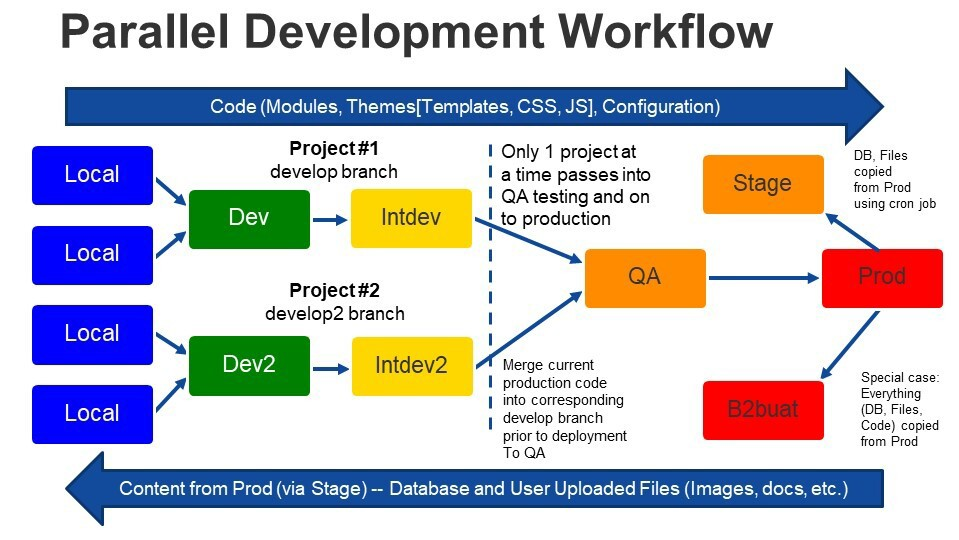

# Parallel Development Track
 
 The primary development Git workflow, simplified, is

1.  Someone on project opens a Pull Request to merge the master branch into the develop2 branch

2.  Developer creates a feature branch from the develop branch

3.  Developer does work and commits to the feature branch, pushing to BitBucket

4.  Developer opens a Pull Request to merge the feature branch back into the develop branch

5.  For testing, someone on project opens a Pull Request to merge the develop branch into the qa-stage branch

6.  After testing to release to PROD, someone on the project opens a Pull Request to merge the qa-stage branch into the master branch

 
 
 There are occasions when the primary development Git workflow is “busy”, such as once the develop branch has been merged into qa-stage and is undergoing testing, QA or UAT, before being released to PROD. Generally the team will only want to merge bug fixes and last minute features into the develop branch to keep the code base as stable as possible until released.
 
 At the same time it would be rare the development team is completely busy fixing bugs, or there is a code freeze for a period of time. Rather than idle them, a second development branch can be used. The process is very much the same as for the primary development Git workflow with a few small changes.
 
 First the development branch becomes develop2. Second, the develop branch should be merged into develop2 at the start of development using develop2 to have as common a base as possible. It is possible that when the primary develop branch is again merged into qa-stage, it will make sense to also merge it into develop2 to keep develop2 up to date. Third, the develop and develop2 branches need to coordinate such that only one of those branches is being merged into qa-stage until the qa-stage branch is merged into master.
 
 So the development Git workflow is:

1.  Someone on project opens a Pull Request to merge the develop branch into the develop2 branch

2.  Someone on project opens a Pull Request to merge the master branch into the develop2 branch

3.  Developer creates a feature branch from the develop2 branch

4.  Developer does work and commits to the feature branch, pushing to BitBucket

5.  Developer opens a Pull Request to merge the feature branch back into the develop2 branch

6.  For testing, someone on project opens a Pull Request to merge the develop2 branch into the qa-stage branch

7.  After testing to release to PROD, someone on the project opens a Pull Request to merge the qa-stage branch into the master branch The details of the primary development Git workflow are documented in [Individual Development Workflow]() and [Site Studio Development Process]() The details of the parallel development Git workflow are documented in [Individual Development Workflow for Develop2 Branch]()

© 2020-2021. This work is licensed under a [Creative Commons Attribution-ShareAlike 4.0 International License](http://creativecommons.org/licenses/by-sa/4.0/).
