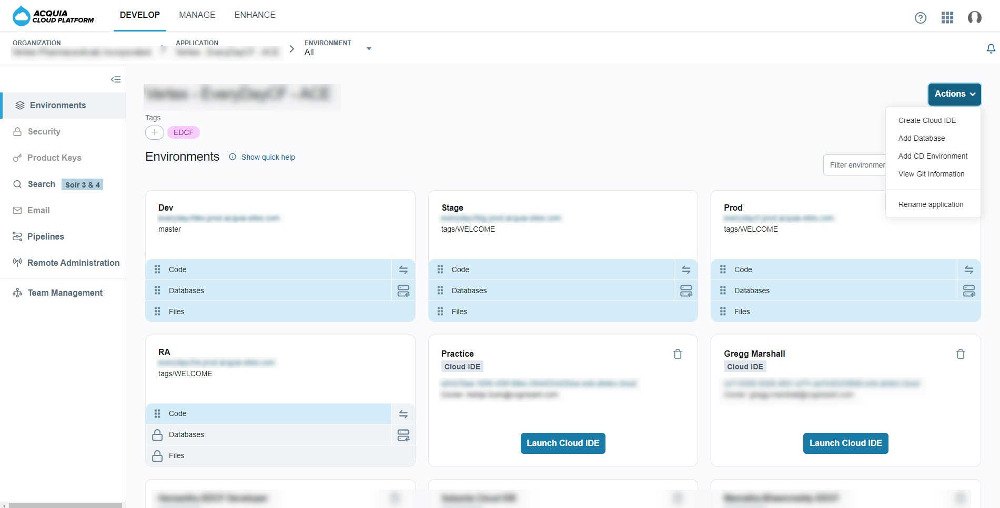
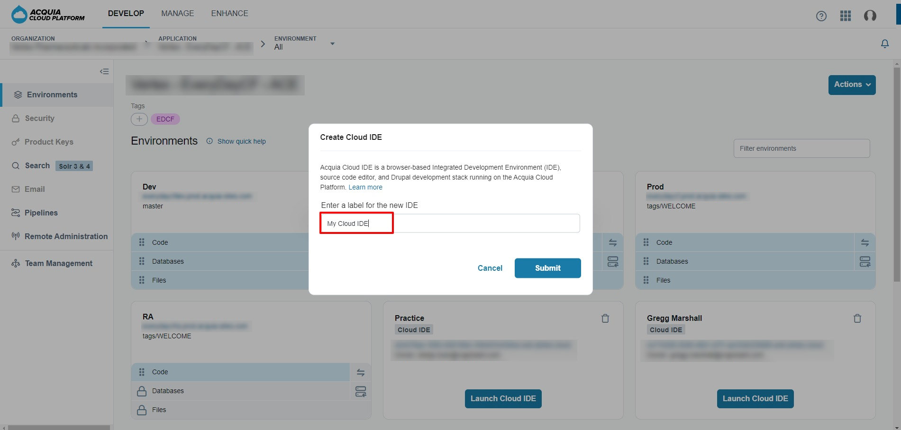
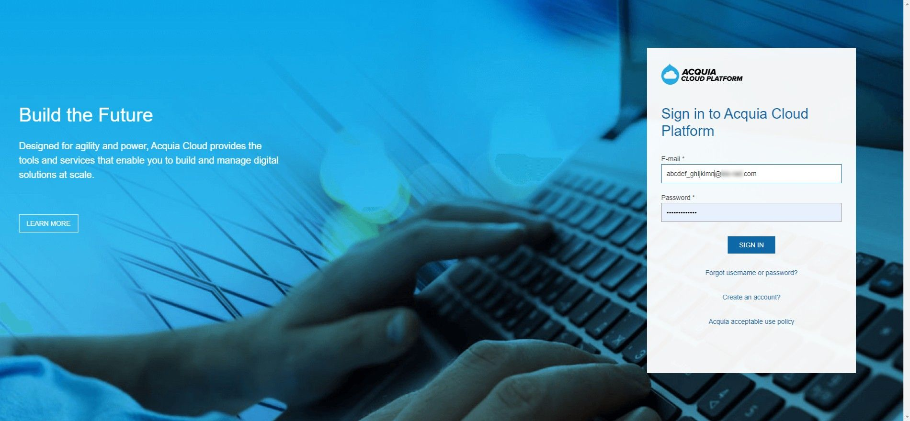
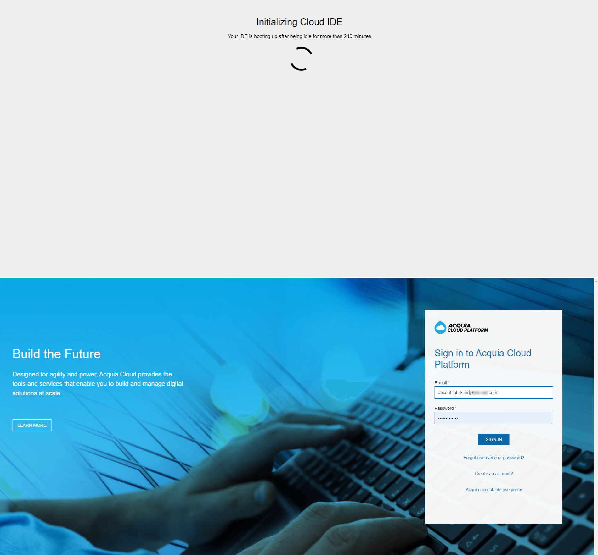
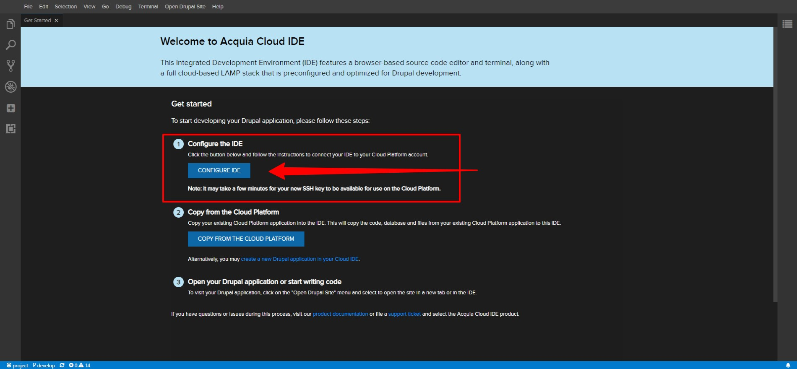
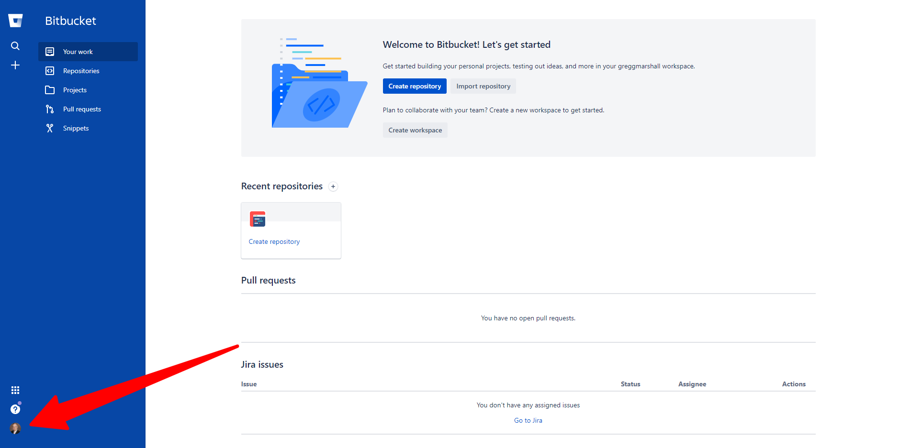
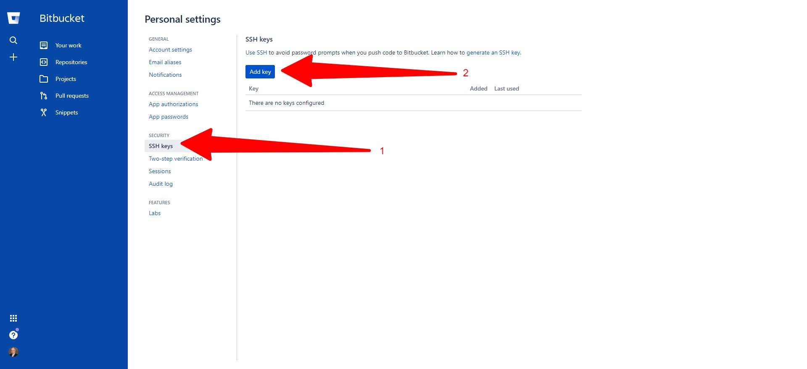
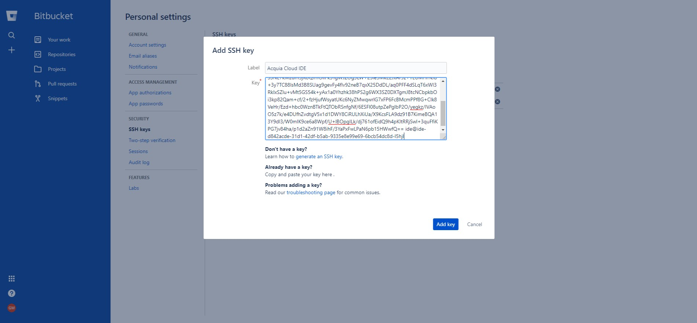
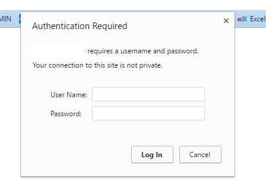
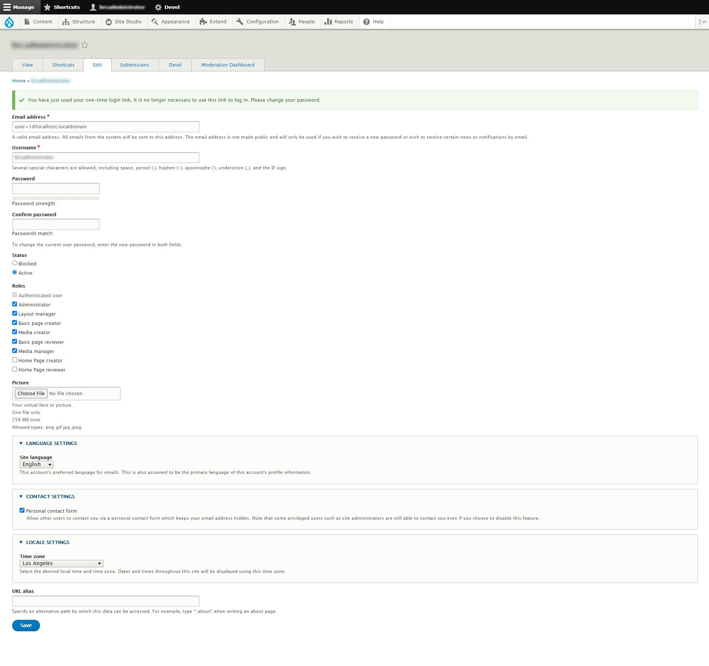

# Setting up a Cloud IDE
 
 These instructions will walk you through setting up an Acquia Cloud IDE instance and connecting it to Acquia, Bitbucket, pull the latest code from Bitbucket, and copy a database and files from one of the Acquia environments to start developing.
 
## Prerequisites

1.  If you haven't installed Acquia CLI, see [Installing Acquia CLI on Windows 10]().

1.  To begin using [Acquia CLI](https://github.com/acquia/cli), authenticate against your Cloud Platform account by using acli auth:login. This command prompts you to open the page from which to create a [Cloud Platform API tokens](https://docs.acquia.com/cloud-platform/develop/api/auth/#cloud-generate-api-tokens) for convenience.
 
**Copy and save the API key & API secret in notepad and save the file where you can reference it.**

Here’s an example output:

````
    $ acli auth:login
    You will need a Cloud platform API token from https://cloud.acquia.com/a/profile/tokens
    Do you want to open this page to generate a token now? y Please enter your API Key: \<ENTER API KEY HERE\>
    Please enter your API Secret: \<ENTER API SECRET HERE\> 
    Saved credentials to /home/\<user\>/.acquia/cloud\_api.conf
````

#### If you get a "cURL error 60: SSL certificate problem: unable to get local issuer certificate..." error

If you get a "cURL error 60: SSL certificate problem: unable to get local issuer certificate (see <https://curl.haxx.se/libcurl/c/> libcurl-errors.html)" error, the process for fixing it is:

Download the latest cacert.pem from [<span class="underline">https://curl.haxx.se/ca/cacert.pem</span>](https://curl.haxx.se/ca/cacert.pem). A good place to store the file is in your C:\\users\\\<your username\>. ssh directory (if you don’t have that directory, create it, you’ll need it later).

1.  Add the following line to php.ini: (if this is shared hosting and you don't have access to php.ini then you could add this to .user.ini in public\_html).

````
    curl.cainfo="C:\\users\\\<your username\>.ssh\\cacert.pem"
````

**Make sure you enclose the path within double quotation marks\!\!\!**
 
It is important to note that this applies to the system sending the CURL request, and NOT the server receiving the request.
 
## Create and Configure Your Cloud IDE
 
List the Cloud IDE’s already defined using:
````
    $ acli ide:list
````
The list will look like

````
    $ acli ide:list
    Please select a Cloud Platform application: [0] Project Company, Inc.
    > 0
    ======================================================================= 
    IDEs
    =======================================================================
    abc_ide (abcde_fghijk@project.com)
    IDE URL: https://36c4204-4c99-4f3a-b6e3-bcb4a0b0cc17.ide.ahdev.cloud Web URL: https://36c4204-4c99-4f3a-b6e3-bcb4a0b0cc17.web.ahdev.cloud
    =======================================================================
    def_ide (cefgh_ijklmn@project.com)
    IDE URL: https://44539817-0b47-4e78-920a-945fe6084f9.ide.ahdev.cloud Web URL: https://44539817-0b47-4e78-920a-945fe6084f9.web.ahdev.cloud
    =======================================================================
    ghiSampleIDE (ghijkl_mnopqrst@project.com)
    IDE URL: https://98fb58e-3122-4476-83b1-bf8246f46c84.ide.ahdev.cloud Web URL: https://98fb58e-3122-4476-83b1-bf8246f46c84.web.ahdev.cloud
    =======================================================================
    klmnopqr (jklmno_pqrstuvwx@project.com)
    IDE URL: https://93d0097-90c7-4fa9-a1c2-b609f176c537.ide.ahdev.cloud Web URL: https://93d0097-90c7-4fa9-a1c2-b609f176c537.web.ahdev.cloud
    =======================================================================
````

## Deleting an IDE
 
 If your IDE is already there and you want to delete it, the IDE alias is shown next to the person’s email address and above the IDE URL. As an example, the alias of the second IDE in the above list is “def\_ide”. Since IDE aliases can contain spaces, we recommend you enclose the IDE alias in quotes.
 
````
    $ acli ide:delete "alias name"
````

 Note that when you delete an IDE, **ALL** settings are deleted with it. Deleting an IDE and recreating it is a way to reset a Cloud IDE. You will need to wait 3-5 minutes after deleting an IDE before recreating it, otherwise you might get an error there are no available Cloud IDEs.
 
## Create your Cloud IDE and give it a label (or alias)

````
    $ acli ide:create
    Please select a Cloud Platform application: [0] Project Company, Inc.
    > 0
    Please enter a label for your Cloud IDE:
    >alias_name
````

Alternatively you can create your Cloud IDE from the Acquia Cloud UI.  Login into https://acquia.com and navigate to the environments page for the application you want to create the Cloud IDE in (every application has its own Cloud IDEs and a Cloud IDE from one application can't be used to work on another application).  Click the down arrow in the Actions button and select Create A Cloud IDE.

 

Then give your Cloud IDE a name and click Create.  It takes a few minutes to provision the Cloud IDE.  Then you can select Launch IDE to enter it and set it up.

 


## Setting up Your Cloud IDE

1.  From the command line on your local computer, run the following command to open your IDE and select the IDE you wish to open:

````
    $ acli ide:open
    Please select a Cloud Platform application: [0] Project Company, Inc.
    > 0
    Please select the IDE you'd like to open: [0] swaps_ide
    [1] abc_ide
    [2] def_ide
    [3] ghj_ide
    [4] ARP_IDE
    [5] klmnopqr
    [6] sllakjdslj
    [7] smandadhi2
    [8] Project Architect
    [9] delete_me
    > 9
    Your IDE URL: https://d84acde-31d1-42df-b5ab-933e8e99e69.ide. ahdev.cloud
    Your Drupal Site URL: https://d84acde-31d1-42df-b5ab-933e8e99e69. web.ahdev.cloud
    Opening your IDE in browser...
    [warning] Could not find a browser on your local machine.
````

If you see a warning like line 21 above, you will need to manually copy the IDE URL shown and paste it into your browser address bar.

2.  When you visit your Cloud IDE for the first time you need to log into Acquia

 

3.  If you visit your Cloud IDE after about 4 hours, you will see the following while the environment is recreated (nothing is lost), and then need to log into Acquia

 

4.  In the Cloud IDE **Get Started** Page, click **CONFIGURE IDE** to connect the IDE to your Cloud Platform account. This authenticates the IDE with the Cloud Platform API and then automatically generates an SSH key that is linked to your Cloud Platform user account.
 
 
 
Clicking the CONFIGURE IDE button will open the Cloud IDE terminal with the command “acli ide:wizard:ssh-key:create-upload” which will walk you through entering your API Key and API secret (you can use the API Key and API secret you generated to set up your local acli). The wizard will automatically create your SSH key and upload it to Acquia.

````
    $ acli ide:wizard:ssh-key:create-upload
    We strive to give you the best tools for development.
    You can really help us improve by sharing anonymous performance and usage data.
    Would you like to share anonymous performance usage and data? (yes/no) \[yes\]:
    > yes
    Awesome\! Thank you for helping\!
    You will need a Cloud Platform API token from https://cloud.acquia.com/a/profile/tokens
    Please enter your API Key:
    > 0106029-2620-4170-a6e5-08abcde4c5d
    Please enter your API Secret:
    Saved credentials to /home/ide/.acquia/cloud\_api.conf 
    Creating a local SSH key
    Uploading the local key to the Cloud Platform 
    Adding the SSH key to local keychain
    Waiting for the key to become available on the Cloud Platform 
    Your SSH key is ready for use\!
    delete\_me:\~/project $
````

1.  While in the terminal set your PHP memory limit to unlimited by moving to the php configuration directory and edit the custom.ini file, you can use nano or vi, add **memory\_limit=-1** and save the file :

````
    $ cd /home/ide/configs/php
    $ nano custom.ini
    $ cat custom.ini
    ; Acquia Cloud IDE PHP settings
    ; Use this file to overwrite the default PHP settings. memory_limit=-1
    Set up Git on your IDE with three configuration items:
    $ git config --global user.email "your project email address"
    $ git config --global user.name "your full name"
    $ git config --global pull.rebase false
````

## Configure Bitbucket with Cloud IDE SSH Keys

1.  Navigate to <http://bitbucket.org> (or your alternative way you access Bitbucket) and log in.

2.  When Bitbucket opens, navigate to your user icon in the lower left side of the screen, click it and select “Personal Settings”

 

3.  In the Personal Settings screen, select SSH Keys, the click the Add Key button

 

4.  Switch to your Acquia Cloud IDE browser tab and in the terminal type

````
    ls -la \~/.ssh 
    total 24
    drwxr-xr-x 2 ide ide 4096 Dec 9 19:33 .
    drwxr-xr-x 23 ide ide 4096 Dec 9 19:53 ..
    -rw-r--r-- 1 ide ide 74 Dec 4 16:26 config
    -rw------- 1 ide ide 3326 Dec 9 19:33 id_rsa_acquia_ide_d842acde-31d1-42df-b5ab-9335e8e99e69
    -rw-r--r-- 1 ide ide 787 Dec 9 19:33 id_rsa_acquia_ide_d842acde-31d1-42df-b5ab-9335e8e99e69.pub
    -rw-r--r-- 1 ide ide 884 Dec 9 19:33 known_hosts
    $ cat ~/.ssh/id_rsa_acquia_ide_d842acde-31d1-42df-b5ab-9335e8e99e69.pub
    ssh-rsa AAAAB3zaC1yc2EAAAADAQABAAACAQC6VNKXTbSjBUPD8bNwH+idhMB4lkhRJyg4B0g
    0nlCXMCQNUq+IxgJjObHZRL7qE8S0MwdBAIP7fBZ+wRQoGFjOcdICRu
    qfiq3konuku/M17AKcStykklUXIEaXU
    pM1xElMz34RzwYwu4LX+Z2T5hJgtBmXKtD4PULSeZzAO3W4X0ROKyfeU66Qv7zxL7 
    TH1LIsxoKdaZYFWS3NE7kMzdm3jKoQfmOllFk3TgWJZOg5LW+25le5MkE2JxAr9z+YE 
    UMHrNJb+3y7TC8lsMd3B8SUag9gevFy4flv92neB7qxX25DdDL
    aq0PFF4dSLqT6xWI3RkIxSZlu+vMt5GS54k+yAx1a0Yhzhk38PS2g6WX3SZ0DXTgmJ8tcNCbpkbOi3kp82Qam+cf
    2+fzHjufWsyatUKc6NyZMwqwrlG7xFP6FcBMcmPPf8G+Clk8VeHr
    Ezd+hbc0WznBTkFtQTObRSnfgNf/6ESFl08utpZePglbP2OyegkzIVAoO5z7k
    e4DUfhZvdtgV5x1d1WY8CiRULhXiUa/X9KcsFLA9dz91B7KimeBQA13Y9dI3
    W0mIK9ce6a8WpfU+lBOpgILk
    dj761ofEidQ9h4pKltRRjSwl+3quFfiKPG7jv84hap1d2aZn91W8ihF
    3YaPxFwLPaN6pb15HWwfQ== ide@ide-d84acde-31d1-42df-b5ab- 9335e899e69-6bcb5dc8d-l5hjl
    $
````

5.  Copy the text output from the cat command (line 10 above) and switch to your Bitbucket browser tab and paste the text copied into the key field. Name your key Acquia Cloud IDE

 

6.  Clone the project repository into your Acquia Cloud IDE using the command

````
    $ git clone git@bitbucket.org:project/project.git . 
    Cloning into '.'...
    The authenticity of host 'bitbucket.org (118.25.93.2)' can't be established.
    RSA key fingerprint is SHA256: zzXQOXSRBEiUtuE8AikJYKwbHaxvc0ojez9YXaGp1A.
    Are you sure you want to continue connecting (yes/no)? yes 
    Warning: Permanently added 'bitbucket.org,118.25.93.2' (RSA) to the list of known hosts.
    remote: Counting objects: 6409, done.
    remote: Compressing objects: 100% (2124/2124), done. 
    remote: Total 6409 (delta 3194), reused 6172 (delta 2999)
    Receiving objects: 100% (6409/6409), 3.52 MiB | 15.25 MiB/s, done. 
    Resolving deltas: 100% (3194/3194), done.
````

7.  Switch to the develop branch of the project repository using the command

````
    $ git checkout develop
    Branch 'develop' set up to track remote branch 'develop' from 'origin'.
    Switched to a new branch 'develop'
````

8.  Use composer to install the repository dependencies. The repository is compatible with Composer V2, which is significantly faster, and takes a lot less memory, than Composer V1. Composer V2 is now standard on Acquia Cloud IDE

````
    $ composer install
    Gathering patches for root package.
    Removing package drupal/core so that it can be re-installed and re-patched.
    - Removing drupal/core (9.0.10) Deleting docroot/core - deleted
    Installing dependencies from lock file (including require-dev) Verifying lock file contents can be installed on current platform. 
    Package operations: 1 install, 0 updates, 0 removals
    Gathering patches for root package. No patches supplied.
    Gathering patches for dependencies. This might take a minute.
    - Installing drupal/core (9.0.10): Extracting archive
    - Applying patches for drupal/core [https://www.drupal.org/files/issues/2869592-remove-update-warning-7.patch]
    [https://www.drupal.org/files/issues/2020-03-24/1356276-531-9.0.x-9.patch]  ([subprofile support] 1356276 - Allow profiles to define a base/parent profile and load them in the correct order)
    [https://www.drupal.org/files/issues/2018-07-09/2914389-8-do-not-test.patch]  (\[subprofile support\] 2914389 - Allow profiles to exclude dependencies of their parent)
    [https://www.drupal.org/files/issues/2019-11-27/2815221-125.patch] (2815221 - Add quickedit to the latest-revision route)
    Package container-interop/container-interop is abandoned, you should avoid using it. Use psr/container instead.
    Package doctrine/reflection is abandoned, you should avoid using it. Use roave/better-reflection instead.
    Generating autoload files
    45 packages you are using are looking for funding. Use the `composer fund` command to find out more\!
````

9.  Set up BLT settings on the Cloud IDE with the command `blt blt:init:settings`

````
    $ blt blt:init:settings
    Could not find blt/example.local.blt.yml/. Create and commit this file if you'd like to automatically generate blt/local.blt.yml/ based on this template.
    Generating hash salt...
    [File\Write] Writing to /home/ide/project/salt.txt.
````

10. Set up the git hooks on the Cloud IDE with the command `blt blt:init:git-hooks`

````
    $ blt blt:init:git-hooks
````

11. Pull the database and files from Acquia Cloud, selecting the Stage environment

````
    $ acli pull --no-code --no-files
    Using Cloud Application Project Company, Inc.
    Choose a Cloud Platform environment: 
    [0] Dev, dev (vcs: tags/1.0.1)
    [1] RA, ra (vcs: tags/WELCOME)
    [2] Stage, test (vcs: tags/WELCOME)
    [2] Prod, prod (vcs: tags/WELCOME)
    > 0
    Downloading Drupal database copy from the Cloud Platform Installing Composer dependencies
    Clearing Drupal caches via Drush Sanitizing database via Drush
````

12. Update local configuration files using the command (not all projects include this step)

````
    $ ./scripts/ide-setup.sh
````

13. Update the database and download the files to the latest configuration export using the command (note the database copy in step 11 is more to allow this step to run than the copy):

````
    blt drupal:sync
````

14. Log into the website using the command `drush uli --name=<user_name>`. Note that `drush uli`”, which would normally log you into your site as user 1 won’t work since user 1 has been disabled. Normally that command would open the browser but not all browsers allow that, if it doesn’t (e.g. Chrome), then copy the url output and copy it into your browser address bar

````
    $ drush uli --name=<user name>
    https://d84acde-31d1-42df-b5ab-9335ee99e69.web.ahdev.cloud/user/reset/1/1607564883/TXjUURop3yyVPacBdj6DuZAgNEB3qOLNVSvgM3bM/login
````

15. If you get below screen when the URL is hit, this means that the Shield is enabled. Enter the user name and password your development team has configured for Shield.

 

16. When you are logged in using the one time link above, change your password to something you can remember

 

© 2020-2021. This work is licensed under a [Creative Commons Attribution-ShareAlike 4.0 International License](http://creativecommons.org/licenses/by-sa/4.0/).
